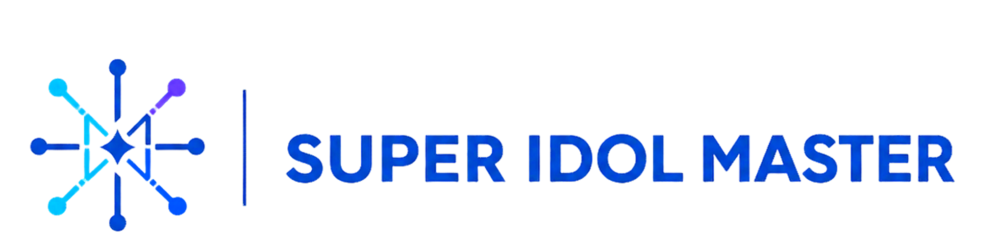
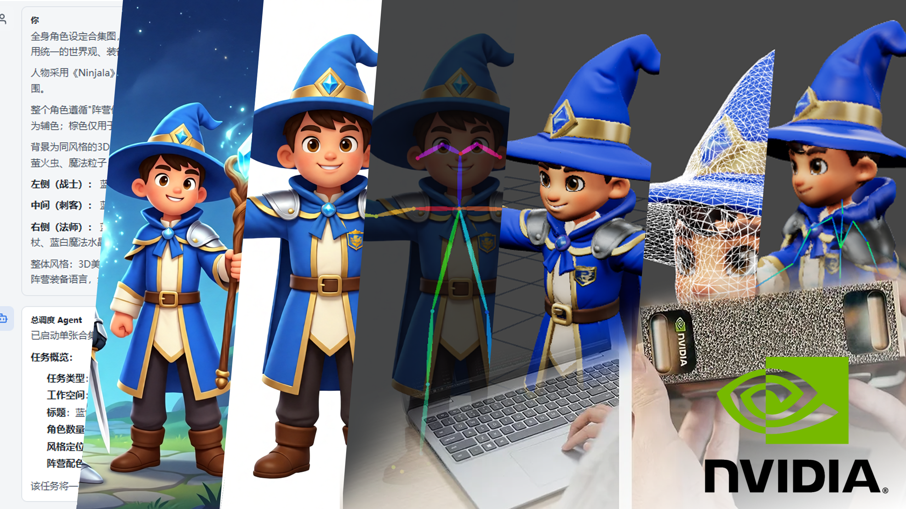

<div align="center">
  

  <p><strong>A quality-gated, multi-agent production line for digital character assets.</strong></p>
  <p><strong>Chinese name: 多智能体数字角色资产生产线</strong></p>
  <p>
    <strong>English</strong> |
    <a href="./README.zh-CN.md">简体中文</a>
  </p>

  <p>
    
    
    
    
    <a href="./LICENSE"></a>
  </p>
</div>

> Built for the second **NVIDIA DGX Spark Hackathon — 10-Day Challenge**.

Super Idol Master turns a character brief, a single concept image, or a multi-character sheet into a recoverable production workflow: character isolation, T-pose generation, visual QA, image-to-3D, automatic retopology, rigging, preview, and export.

Instead of hiding a fixed prompt chain behind a chat box, it gives every character an auditable agent workspace. A coordinator delegates work, a task supervisor advances the state machine, specialist agents review each stage, and deterministic quality gates decide whether an asset can proceed, must be repaired, or should be regenerated.

<p align="center">
  
</p>

## Why Super Idol Master

Character asset production is usually fragmented across image generation, pose conversion, 3D reconstruction, topology, rigging, and manual QA. Super Idol Master connects those tools into one stateful system with four design priorities:

- **An agent team, not a prompt chain.** A workspace-level `Coordinator`, a per-task `Supervisor`, and seven read-only specialists keep orchestration, review, and execution responsibilities separate.
- **Quality gates before expensive work.** T-pose geometry, background purity, character consistency, topology, and rigging are checked before the next stage is allowed to run.
- **Goal-driven recovery.** The supervisor can continue, retry, repair, or roll back from persisted evidence instead of restarting the entire workflow.
- **Hybrid cloud and local compute.** StepFun services handle language and selected image operations, while NVIDIA DGX Spark runs GPU-heavy 2D/3D workflows through ComfyUI and standalone services.

## What It Produces

Two input paths converge on the same quality-gated asset pipeline:

```text
Character description
  → concept image
  → T-pose image
  → T-pose QA
  → static 3D model
  → retopology
  → rigging
  → GLB export

Concept image or multi-character sheet
  → character isolation
  → T-pose image
  → T-pose QA
  → static 3D model
  → retopology
  → rigging
  → GLB export
```

Each character task keeps its own conversation, stage history, generated artifacts, QA reports, and recovery state.

## Agent Team

Super Idol Master defines nine logical roles. Only the coordinator and supervisor may mutate workflow state; specialist agents return structured recommendations and evidence.

| Layer | Role | Responsibility |
| --- | --- | --- |
| Workspace | `Coordinator` | Understands collection-level requests, creates workspaces and character tasks, and delegates goals. |
| Task | `Supervisor` | Owns the task state machine, selects the next action, handles retries, and reports progress. |
| Specialist | `Art Director` | Reviews visual direction, silhouette, style, and production constraints. |
| Specialist | `Visual QA` | Checks framing, T-pose geometry, background purity, and visible defects. |
| Specialist | `Character Consistency` | Compares identity, costume, color, and key design features across stages. |
| Specialist | `3D Technical Director` | Reviews reconstruction readiness and mesh quality. |
| Specialist | `Topology QA` | Reviews topology output and downstream rigging suitability. |
| Specialist | `Rigging Specialist` | Reviews skeleton placement, weights, and deformation readiness. |
| Specialist | `Pipeline Technical Director` | Diagnoses service failures and recommends safe recovery actions. |

```text
User
  └─ Coordinator
      ├─ workspace and collection planning
      └─ Character Task
          └─ Supervisor
              ├─ specialist review
              ├─ deterministic quality gate
              └─ generation / repair / retry / rollback
```

## Quality-Gated Pipeline

| Stage | Primary runtime | Gate or evidence |
| --- | --- | --- |
| Concept generation | StepFun image API or DGX Qwen Image | Valid PNG and character specification |
| T-pose conversion | StepFun image-to-image | Single full body, horizontal arms, clean background, no held props |
| T-pose QA | SDPose + Visual QA | Pose geometry, framing, background purity, identity consistency |
| Image-to-3D | DGX Pixal3D via ComfyUI | Valid static GLB and preview |
| Retopology | Standalone AutoRemesher service | Valid remeshed GLB and topology evidence |
| Rigging | DGX SkinTokens via ComfyUI | Skeleton and skinning evidence |
| Delivery | Web application | Downloadable GLB plus persisted task history |

The web application also provides interactive static and rigged GLB previews, skeleton and wireframe overlays, temporary pose controls, reusable Mixamo animation preview, queue progress, approval modes, and workspace notifications.

## Architecture

Super Idol Master combines a Windows orchestration host, cloud model APIs, and DGX-local generation services:

```text
Next.js + React UI
        │
        ▼
Node.js API and persistent workflow state
        │
        ├─ Pi agent runtime → StepFun step-3.7-flash
        ├─ StepFun image APIs
        ├─ SQLite task / event / conversation store
        └─ Tailscale private network
                │
                ▼
        NVIDIA DGX Spark
          ├─ ComfyUI: Qwen Image / SDPose / Pixal3D / SkinTokens
          └─ AutoRemesher + Blender service
```

See [ARCHITECTURE.md](./ARCHITECTURE.md) for component boundaries and data flow.

## Quick Start

### Prerequisites

- Windows 10 or 11
- Node.js `22.19.0` or later
- Python `3.12`
- [`uv`](https://docs.astral.sh/uv/)
- A valid StepFun API key
- Optional: NVIDIA DGX Spark services for the full 2D/3D pipeline

### Run locally

```powershell
git clone https://github.com/SidneyArt/Super-Idol-Master.git
cd Super-Idol-Master
copy web\.env.example web\.env.local
```

Configure at least:

```dotenv
STEPFUN_AGENT_API_KEY=...
STEPFUN_AGENT_MODEL=step-3.7-flash
```

Then launch the local application:

```powershell
.\start-local.cmd
```

Open `http://localhost:3100`.

The launcher installs the required web dependencies, creates the Python environment from the lockfile, and starts the local application. For manual startup:

```powershell
cd web
npm install
npm run local
```

For DGX, ComfyUI, Tailscale, image-model, and AutoRemesher settings, follow the [full-stack setup guide](./docs/getting-started/local-fullstack-web.md) and the [DGX integration guide](./docs/deployment/dgx-pipeline-integration.md).

## Configuration

Configuration is split by operational boundary:

| Location | Purpose |
| --- | --- |
| `web/.env.local` | Local secrets, StepFun credentials, server defaults, and private DGX endpoints |
| Web model settings | User-editable text, image, and DGX model configuration |
| `deploy/dgx/*.env` | Standalone DGX service configuration |
| `output/` | Generated images, models, and runtime evidence; never commit |

Start from [`web/.env.example`](./web/.env.example). Never commit API keys, private network addresses, SQLite databases, or generated assets.

## Project Layout

```text
Super-Idol-Master/
├─ web/                    # Next.js UI, API routes, state machine, and agent runtime
├─ docs/                   # Architecture, deployment, product, and troubleshooting guides
├─ deploy/dgx/             # DGX-local AutoRemesher and related deployment assets
├─ image/                  # Image workflow source material
├─ output/                 # Runtime artifacts, excluded from Git
├─ ARCHITECTURE.md         # System architecture overview
├─ start-local.cmd         # One-click local launcher
└─ README.zh-CN.md         # Chinese documentation
```

## Development

```powershell
cd web
npm run lint
npm test
npm audit --omit=dev
npm run python:check
npm run agent:verify
```

`npm run agent:verify` calls the configured model API and therefore requires valid credentials.

## Documentation

- [Documentation index](./docs/README.md)
- [Current project baseline](./docs/getting-started/current-project-baseline.md)
- [Local full-stack setup](./docs/getting-started/local-fullstack-web.md)
- [DGX / ComfyUI pipeline integration](./docs/deployment/dgx-pipeline-integration.md)
- [Standalone AutoRemesher deployment](./docs/deployment/dgx-autoremesher-deployment.md)
- [Pi agent runtime decision record](./docs/architecture/agent-runtime-pi-adr.md)
- [Hackathon submission audit](./docs/product/hackathon-submission-audit.md)
- [Chinese README / 中文说明](./README.zh-CN.md)

## Scope and Security

This repository is a hackathon prototype, not a hosted multi-tenant service. The web and management APIs listen on loopback by default. ComfyUI and the unauthenticated AutoRemesher API must remain behind a private network and access controls. The backend executes only allow-listed scripts and parameters, validates workflow uploads, constrains generated paths to `output/`, and does not expose shell, arbitrary file access, or Git to asset agents.

## License

The software in this repository is licensed under the [PolyForm Noncommercial License 1.0.0](./LICENSE). Noncommercial use, modification, and redistribution are permitted under its terms. Commercial use requires separate prior written authorization from the copyright holder.

Third-party models, services, workflows, and sample assets remain subject to their own terms. The Super Idol Master name and logo are not granted for commercial use by the software license.
