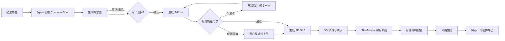
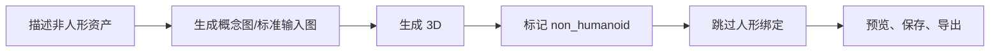
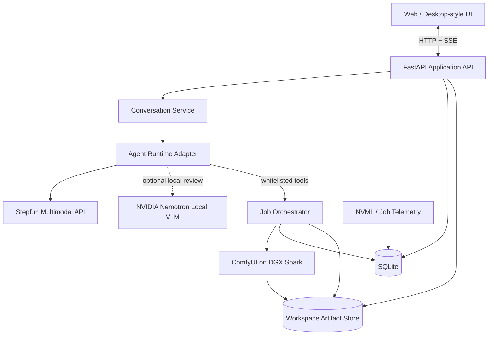

# Super-Idol-Master 对话式角色资产工坊 PRD

> 文档版本：v1.0  
> 状态：5 天黑客松执行版  
> 更新日期：2026-07-18  
> 目标赛事：NVIDIA × Stepfun × 赞奇科技 DGX Spark 多模态 Agent 比赛  
> 产品代号：Super-Idol-Master（数字偶像管家）

## 0. 一页结论

Super-Idol-Master 是一个面向独立游戏开发者、虚拟内容创作者和轻量 3D 团队的对话式角色资产工作台。用户不需要理解 ComfyUI 节点、图生 3D 参数或自动绑骨流程，只需描述角色、选择候选图并在关键节点确认，即可完成：

`角色想法 → 概念图 → T-Pose 图 → 3D 模型 → 自动绑骨蒙皮 → 预览 → 导出`

本项目的竞赛核心不是“给 ComfyUI 套一层聊天框”，而是解决生成式 3D 工作流中的三个真实断点：

1. **跨阶段语义断裂**：概念描述、图片提示词、T-Pose、3D 和绑定结果缺乏统一规格与可追溯关系。
2. **生成结果不可控**：T-Pose、人形判定和绑定前置条件若不检查，昂贵的后续任务容易无效执行。
3. **专业工具门槛高**：普通创作者难以编排多模型、理解失败原因、管理中间资产和复现结果。

产品采用“受控多智能体 + 确定性任务编排”的混合架构：

- Stepfun 多模态模型负责理解意图、规划工具、图片审查和解释结果。
- NVIDIA DGX Spark 在本地运行 2D、3D、绑骨工作流，并可运行 NVIDIA Nemotron 视觉模型进行本地复核。
- 确定性任务编排器负责状态机、确认节点、重试、取消、资产保存和失败恢复。
- 所有生成物保存提示词、种子、模型及工作流版本，形成可复现的资产谱系。

### 0.1 五天版本的成功定义

在一台 DGX Spark 和一台演示客户端上，完成至少一条可重复演示的主链路：

1. 用户自然语言描述一个人形角色。
2. Agent 生成结构化角色规格和概念图。
3. 用户在消息气泡中选择图片。
4. 系统生成并检查 T-Pose 图；不合格时给出原因并允许一次修复。
5. 用户确认后生成 GLB。
6. 系统完成人形判定、自动绑骨和蒙皮。
7. 用户可在对话气泡及页面级全屏视图中查看 2D、3D 和骨骼模型。
8. 用户将资产保存到工作区并导出 GLB 与元数据。
9. 演示中可展示每阶段耗时、模型、种子、工作流版本和 DGX Spark 资源指标。

### 0.2 关键范围决策

| 能力 | 五天版本决策 | 原因 |
|---|---|---|
| 浏览器 Web 应用 | P0 必须完成 | 最短路径获得完整前后端和稳定演示 |
| Electron/Tauri 原生封装 | P1，有余力再做 | 封装不应阻塞主流程；Web 已体现桌面式交互 |
| 概念图到身份一致的 T-Pose | P0，但必须有降级路径 | 是 2D 到 3D 的质量瓶颈；现有纯文生图工作流尚不能证明身份一致 |
| 图生 3D | P0 | 已有 Pixal3D 工作流与 Python 调用代码 |
| 人形自动绑骨蒙皮 | P0 | 已有 SkinTokens 工作流与 Python 调用代码 |
| 3D 旋转、缩放、平移预览 | P0 | 直接决定 Demo 可视化效果 |
| 骨骼显示、选骨、临时旋转 | P0 轻量版 | 只修改预览场景，不写回 GLB |
| Mixamo 动画重定向 | P2/实验项 | 当前技术链路未验证，不作为主 Demo 成败条件 |
| 非人形自动绑骨 | 不做 | 明确打标并在 3D 阶段结束，避免错误执行 |
| 模型精修、网格编辑、权重绘制 | 不做 | 超出五天范围和目标用户的低门槛定位 |

---

## 1. 背景与机会

### 1.1 行业问题

独立游戏、虚拟直播、短视频和数字营销都需要大量角色资产，但传统生产链路要求用户跨越概念设计、3D 建模、拓扑、UV、绑骨、蒙皮和动画等多个专业环节。生成模型降低了单点生产成本，却没有消除跨工具编排、质量检查和资产管理成本。

现有生成式 3D 工具通常存在以下问题：

- 输入输出分散在多个页面或节点工作流中。
- 用户需要手工复制提示词、文件路径和模型参数。
- 概念图适合展示，却不一定适合图生 3D 和自动绑骨。
- 非人形模型可能被错误送入人形绑定流程。
- 生成失败后，用户不知道应修改提示词、图片姿势还是模型参数。
- 中间产物缺少版本、父子关系和生成参数，无法复现或继续创作。

### 1.2 产品机会

将多模态 Agent 放在“创作意图”和“确定性 GPU 工作流”之间，可以让 Agent 承担最有价值的语义工作：

- 把模糊创意转换为结构化角色规格。
- 根据后续模型要求生成不同阶段的提示词。
- 读取图片并进行质量检查，而不是盲目进入下一阶段。
- 根据人形类别、安全规则和用户确认决定可调用的工具。
- 用自然语言解释失败并提出最小修改建议。

DGX Spark 的本地统一内存和 NVIDIA AI 软件栈适合承载多模型串联的长任务；Stepfun 原生多模态与工具调用能力适合作为对话和视觉推理入口。二者组合使项目同时具备本地高算力、数据不离开工作站的潜力和自然交互能力。

### 1.3 当前工程基线

仓库当前已经具备以下实现：

- `run_2d_generation.py`：向 Qwen-Image-2512 工作流注入正向提示词、反向提示词和种子。
- `run_3d_generation.py`：上传输入图片并执行 Pixal3D/TRELLIS2 图生 3D 工作流。
- `run_3d_skinning.py`：将 GLB 输入 SkinTokens，目标骨骼命名配置为 `mixamo`。
- `run_comfy_workflows.py`：同步串联 `2D → 3D → SkinTokens`。
- `comfy_client.py`：提交、轮询、下载并保存 workflow、history 和 artifacts 元数据。

当前工作流还包含以下已发生的优化：

- 2D 模型使用 FP8 权重和 4-step Lightning LoRA。
- 3D 工作流使用 Pixal3D BF16、MoGe-2、TRELLIS2、网格简化、重拓扑和纹理烘焙节点。
- 所有本地下载限制在仓库 `output/` 目录内。
- 每次运行保存提交的工作流和 ComfyUI history。

仍需在产品化前补齐：

- 异步 Job API、事件流、取消和持久化状态。
- 对话 Agent 和严格的领域工具 Schema。
- 概念图到 T-Pose 的身份保持工作流。
- 自动图片质量门禁和非人形分流。
- Web 前端、工作区、消息内资产卡片和 3D/骨骼预览。
- 统一资产元数据和父子谱系。
- DGX Spark 环境上的连续端到端冒烟验证。

> 注：团队已说明三条 ComfyUI 工作流可由 AI 正常调用。当前仓库快照能够验证调用代码和部分运行记录；比赛版本仍应在正式演示设备上执行连续端到端验证，不能以单次历史结果代替发布验收。

---

## 2. 产品定位

### 2.1 产品愿景

让没有专业 3D 管线经验的创作者，也能通过一段对话获得可预览、可追溯、可继续加工的角色资产。

### 2.2 产品定位语句

对于需要快速制作角色原型的独立游戏开发者和数字内容创作者，Super-Idol-Master 是一个运行在 DGX Spark 上的多模态角色资产 Agent。它将概念图、标准姿势图、图生 3D、自动绑骨、质量检查和资产管理组织成一条有人类确认的可靠生产链，而不是只返回不可追溯的单次生成结果。

### 2.3 核心价值

| 价值 | 用户收益 | 可演示证据 |
|---|---|---|
| 低门槛 | 一段自然语言启动完整创作流程 | 对话到 GLB 的端到端 Demo |
| 可控 | 在图片选择、3D、绑骨前设置确认和质量门禁 | Agent 拦截不合格 T-Pose 或非人形输入 |
| 可追溯 | 每个资产带提示词、种子、模型、工作流版本和父资产 | 工作区资产详情及导出 `metadata.json` |
| 可交互 | 图片、3D、骨骼模型直接嵌入消息和全屏查看 | Three.js 交互预览 |
| 可扩展 | Agent 与任务层解耦，后续可替换模型和工作流 | 统一工具 Schema 与 Runtime Adapter |

### 2.4 非目标

五天版本不试图替代 Blender、Maya 或完整游戏资产生产管线，也不承诺生成结果可直接用于所有商业项目。它交付的是高质量角色原型和自动化管线验证，最终资产仍可能需要专业人员进行拓扑、蒙皮或动画修正。

---

## 3. 目标用户与 Jobs to Be Done

### 3.1 核心用户

#### 用户 A：独立游戏开发者

- 缺少专职美术和绑定师。
- 需要在数小时内获得角色原型验证玩法。
- 希望导出 GLB，在 Unity、Unreal 或 Web 场景中继续使用。

JTBD：当我只有一个角色想法时，我希望快速获得带骨骼的 3D 原型，以便在投入正式美术预算前验证风格和玩法。

#### 用户 B：虚拟内容创作者

- 熟悉角色设定，但不熟悉 3D 工具链。
- 需要保留不同版本的概念图、T-Pose 和模型。
- 希望通过对话迭代造型，而不是编辑复杂节点。

JTBD：当我构思新的虚拟角色时，我希望用自然语言反复调整形象并管理每次结果，以便选出最适合后续制作的版本。

#### 用户 C：3D 团队的前期设计师

- 需要批量探索角色方向。
- 关注提示词、种子和生成链路是否可复现。
- 需要将中间资产交给建模或技术美术继续处理。

JTBD：当我进行角色预研时，我希望系统保存完整生成上下文和资产关系，以便团队能够复现、比较和继续加工。

### 3.2 非核心用户

- 需要电影级拓扑、毛发、布料和表情绑定的专业角色团队。
- 需要直接生成最终商业 IP、且不能接受人工复核的用户。
- 需要非人形自动骨骼、程序化动画或复杂动作捕捉的用户。

---

## 4. 产品目标与衡量指标

### 4.1 五天目标

1. 完成可操作的前端、后端、Agent、工作流、资产存储和文档闭环。
2. 证明多模态 Agent 能在至少两个关键节点提升流程可靠性：T-Pose 质检和人形分流。
3. 证明 DGX Spark 能本地承载连续的 2D、3D、绑骨任务，并展示资源与耗时数据。
4. 形成一条 3～5 分钟内可讲清价值、技术和结果的演示叙事。

### 4.2 北极星指标

**有效资产链完成率**：从创建 `CharacterSpec` 到获得可在查看器中正常加载的最终目标资产链的任务占比。

- 人形目标：概念图、T-Pose、未绑定 GLB、已绑定 GLB 全部存在且谱系完整。
- 非人形目标：概念图、标准生成输入图、未绑定 GLB 存在，并正确跳过人形绑定。

### 4.3 发布门槛

| 指标 | 五天发布门槛 | 说明 |
|---|---:|---|
| 主 Demo 连续成功次数 | 3 次 | 使用固定演示提示词和已验证环境 |
| 端到端状态可追踪率 | 100% | 每个阶段都有 Job 状态和错误信息 |
| 资产元数据完整率 | 100% | 提示词、种子、模型、工作流哈希、父资产齐全 |
| 非人形错误进入绑骨次数 | 0 | 自动判定与用户确认双重保护 |
| T-Pose 明显不合格仍自动进入 3D 次数 | 0 | 低置信度时必须停下确认 |
| 2D/GLB 预览成功率 | 100%（演示集） | 浏览器无崩溃、无空白画布 |
| 高成本操作确认覆盖率 | 100% | 3D、绑骨、覆盖、导出均需显式规则 |

### 4.4 实验指标，不作为未经测试的宣传结论

- 原始提示词与结构化提示词的 T-Pose 首次通过率。
- 无视觉质检与视觉质检后的无效 3D 任务比例。
- Stepfun 与本地 Nemotron 对人形/T-Pose 判定的一致率。
- 2D、3D、绑定各阶段 P50/P95 耗时。
- 各阶段统一内存峰值、GPU 利用率和失败率。
- FP8 + 4-step 工作流相对非加速配置的耗时变化。

所有比赛展示数字必须来自固定测试集和日志，不使用未测量的“提升 X%”表述。

---

## 5. 范围与优先级

### 5.1 P0：比赛必须交付

#### 对话与会话

- 创建、切换和重命名会话。
- 流式显示 Agent 文本、工具调用状态和任务进度。
- 支持用户发送文字、工作区图片或 3D 资产到当前会话。
- 在高成本和不可逆操作前请求确认。

#### 角色规格与概念图

- 将自然语言转换为结构化 `CharacterSpec`。
- 显示 Agent 理解到的角色类型、风格、服装、色彩、体型和用途。
- 生成人物概念图，要求单角色、全身、纯白或近白背景、符合角色风格的展示 Pose。
- 用户可选择、重新生成或基于文本反馈修改。
- 选择后锁定为当前角色分支的概念图。

#### T-Pose 与质量门禁

- 基于选中概念图生成 T-Pose 图。
- 主路径必须使用图像条件或图像编辑工作流保持身份；不能只把“看起来相似”描述成身份一致。
- 保存身份锚点：发型、面部、服装、主色、配饰、体型。
- 多模态质检检查单角色、全身、正面、双臂近水平、双腿自然分开、无遮挡、纯白背景。
- 不合格时提供原因、一次自动修复或用户重试。
- 若图像编辑工作流未按期完成，降级为“用户上传 T-Pose”或“文本重建并明确提示一致性风险”，不得静默继续。

#### 3D 与人形分流

- 将通过确认的图片送入 Pixal3D 工作流并生成 GLB。
- 在任务前根据 `asset_kind` 分为 `humanoid`、`non_humanoid`、`unknown`。
- `non_humanoid` 默认跳过绑骨和 Mixamo 动画。
- `unknown` 必须由用户确认，不允许 Agent 自主假定为人形。

#### 自动绑骨与蒙皮

- 对已确认的人形 GLB 调用 SkinTokens。
- 保存未绑定和已绑定两个独立资产，不覆盖原文件。
- 绑定后执行结构检查：GLB 可加载、存在骨骼/蒙皮对象、无缺失文件。
- 绑定失败时保留原模型、错误和重试入口。

#### 预览

- 图片卡片嵌入消息气泡。
- GLB 卡片嵌入消息气泡，支持旋转、滚轮缩放和相机平移。
- 卡片右上角有页面级全屏按钮。
- 全屏 3D 查看器支持重置相机、网格开关、骨骼显示开关。
- 对已绑定角色支持选中骨骼和临时旋转；关闭或重置后恢复原始 Pose，不写回资产。

#### 工作区

- 创建、重命名、切换工作区。
- 按图片、未绑定 3D、已绑定 3D 过滤资产。
- 点击资产进入页面级全屏预览。
- 将资产发送到当前 Agent 会话。
- 保存 2D 图对应的正向/反向提示词、种子及模型参数。
- 导出单个 GLB/图片，或导出包含资产与 `metadata.json` 的 ZIP。

#### 可观测性与展示

- 显示每阶段排队、运行、成功、失败、取消状态。
- 显示模型名、工作流版本/哈希、种子、耗时。
- 采集 DGX Spark GPU 利用率和统一内存使用信息；无法采集时不展示伪造数据。
- 提供一键打开“本次创作链路”视图。

### 5.2 P1：主链稳定后实现

- Electron 或 Tauri 桌面封装。
- NVIDIA Nemotron Nano 12B V2 VL FP8 本地图像复核和断网降级。
- 生成四视图或旋转预览图供 3D 质检 Agent 分析。
- 资产版本对比和“从此版本分叉”。
- 任务取消后调用 ComfyUI 中断接口，而不只是停止前端轮询。
- 骨骼关键节点 Mixamo 命名覆盖检查。
- 工作区搜索和标签编辑。
- 会话恢复、应用重启后恢复未完成任务。

### 5.3 P2：赛后路线

- Mixamo 动画上传、骨骼映射与动画重定向。
- 动画播放列表、裁切和导出。
- 非人形骨骼生成。
- 多视图一致性生成和角色身份 LoRA。
- 网格修复、权重绘制和 Pose 写回。
- Unity/Unreal/Blender 插件。
- 多人协作、云同步和远程任务队列。
- OpenUSD 资产封装和 NVIDIA Omniverse 集成。
- Audio2Face 表情与口型动画。

### 5.4 黄金路径止损线

P0 是产品需求优先级，不代表五天内可以无条件并行开发全部细节。Day 3 晚上若主链仍不能到达可预览的 rigged GLB，按以下顺序止损：

1. 取消 Nemotron 双模型复核，只保留 Stepfun 主质检。
2. 多工作区退化为一个默认工作区，保留资产谱系和导出。
3. 消息中的 3D 卡片只保留快照与“打开预览”，交互渲染复用一个共享 Viewer。
4. 骨骼临时旋转退化为骨骼显示开关。
5. 取消桌面封装、动画和所有 P1 项。

不可裁剪项：

- `CharacterSpec → 概念图 → T-Pose → 3D → 绑定 → 导出` 黄金路径。
- T-Pose 质量门和非人形分流。
- 真实 Job 状态、失败保留和资产元数据。
- 至少一个可交互 3D Viewer。

止损后的功能应在界面和答辩中如实描述为当前限制，不能用静态 Mock 冒充已实现能力。

---

## 6. 核心用户流程

### 6.1 人形角色主流程



### 6.2 非人形流程



### 6.3 阶段状态机

`DRAFT → CONCEPT_GENERATING → CONCEPT_REVIEW → TPOSE_GENERATING → TPOSE_REVIEW → MODEL_GENERATING → MODEL_REVIEW → RIGGING → RIG_REVIEW → READY_TO_EXPORT`

规则：

- 任何生成状态都可进入 `FAILED` 或 `CANCELLED`。
- 重试创建新的 `JobAttempt`，不覆盖历史结果。
- 非人形从 `MODEL_REVIEW` 直接进入 `READY_TO_EXPORT`。
- 每次跨越高成本阶段必须记录确认人、确认时间和输入资产 ID。
- Agent 建议不能绕过状态机。
- 上游规格或资产发生修改时，所有依赖它的下游资产标记为 `STALE`；旧资产仍可查看和导出，但不能被误认为当前分支的有效结果。

---

## 7. 详细功能需求

### 7.1 FR-01 角色规格

Agent 将用户输入整理为可编辑的结构化规格：

| 字段 | 示例 | 必填 |
|---|---|---|
| `name` | 霓虹忍者少女 | 是 |
| `asset_kind` | humanoid | 是 |
| `style` | 美式 3D 卡通、潮流玩具 | 是 |
| `gender_expression` | 女性化 | 否 |
| `age_expression` | 青年 | 否 |
| `body_shape` | 修长、头身比 1:6 | 是 |
| `hair` | 蓝紫短发、侧马尾 | 否 |
| `face` | 圆脸、大眼 | 否 |
| `outfit` | 轻量忍者夹克、短靴 | 是 |
| `palette` | 紫、青、黑 | 是 |
| `accessories` | 护目镜 | 否 |
| `intended_use` | 游戏角色原型 | 是 |
| `constraints` | 单人、全身、无文字 | 是 |

验收：

- 缺少会影响生成的字段时，Agent 最多提出一轮集中澄清问题。
- 用户可直接说“按你推荐的来”接受默认值。
- 每次修改产生规格版本，不修改历史资产绑定的规格。

### 7.2 FR-02 概念图生成与选择

要求：

- 默认一次生成 1～4 张候选图，比赛默认 1 张以控制等待时间。
- 图片应为全身、单角色、纯白背景。
- 展示 Pose 可表达角色性格，但避免遮挡主体轮廓。
- 每张图显示种子、生成时间和“选择/重试/发送到工作区”操作。
- 用户反馈“衣服更简洁、保留发型”等内容时，只更新相关规格和提示词。

验收：

- 图片可在气泡中加载并打开全屏。
- 选择操作写入 `selected_asset_id`，且后续任务只能引用已选择资产。
- 原图和新版本并存。

### 7.3 FR-03 T-Pose 生成与审查

硬性视觉条件：

- 只有一个完整角色。
- 身体正面朝向镜头。
- 双臂展开，肩部到手腕接近水平。
- 双腿可见，脚部未被裁切，左右肢体不互相遮挡。
- 背景为纯白或接近纯白，无道具、文字和复杂阴影。
- 角色身份锚点尽量与选中概念图一致。

质量报告结构：

```json
{
  "asset_kind": "humanoid",
  "tpose_score": 0.92,
  "identity_score": 0.84,
  "white_background_score": 0.98,
  "full_body": true,
  "single_subject": true,
  "issues": [],
  "decision": "pass"
}
```

决策规则：

- `pass`：允许用户确认进入 3D。
- `repairable`：展示问题，可自动修复最多一次。
- `manual_review`：模型置信不足，交给用户决定。
- `reject`：明显不满足输入条件，禁止自动进入 3D。

VLM 分数是辅助信号，不作为客观真值。比赛前应使用人工标注的小测试集校准阈值。

### 7.4 FR-04 3D 生成

要求：

- 任务提交后立即返回 `job_id`，不能让 HTTP 请求同步等待完整 GPU 任务。
- 输入必须是用户确认的 T-Pose/标准图资产 ID，后端自行解析安全路径。
- 保存输入图片、种子、Pixal3D 工作流哈希和输出 GLB。
- 用户可取消、重试或从同一图片生成新种子版本。
- GLB 生成后先进入 `MODEL_REVIEW`，不自动绑骨。

验收：

- 查看器可加载输出 GLB。
- 原始 GLB 被保存为独立资产。
- 任务失败时错误被转换为用户可理解的信息，同时保留原始诊断日志供开发者查看。

### 7.5 FR-05 人形判定与绑定

判定来源：

1. `CharacterSpec.asset_kind`。
2. T-Pose 图片视觉检查。
3. 用户在进入绑骨前的最终确认。

规则：

- 三者一致为人形时，允许绑定。
- 任一明确为非人形时，默认禁止绑定。
- 有冲突时进入人工确认，不由 Agent 自行覆盖。

绑定验收：

- 输出新的 rigged GLB 资产。
- GLB 可被 Three.js `GLTFLoader` 解析。
- 场景中存在骨骼或 SkinnedMesh 结构；若无则标记失败。
- 预览中显示骨骼层级，并允许至少选择和旋转一个骨骼。
- 任何预览编辑都只存在于内存中的场景副本。

### 7.6 FR-06 消息内资产卡片

图片卡片：

- 缩略图、类型标签、版本、状态。
- 选择、全屏、保存工作区、重新生成。

3D 卡片：

- 内嵌轻量 Three.js Canvas。
- 默认自动取景，支持 OrbitControls。
- 显示 `unrigged`、`rigged`、`non_humanoid` 标签。
- 全屏、重置相机、保存、导出。

性能规则：

- 列表中非当前可见的 3D Canvas 延迟初始化。
- 同屏多个 GLB 时，只让当前交互卡片持续渲染。
- 释放 Geometry、Material、Texture 和 Object URL，避免显存/内存泄漏。

### 7.7 FR-07 页面级全屏预览

“全屏”指应用内容区的页面级覆盖视图，不强制调用操作系统全屏 API。

图片查看器：

- 适应窗口、1:1、缩放、拖动。
- 显示提示词和生成元数据。

3D 查看器：

- 旋转、平移、缩放、重置相机。
- 网格和背景开关。
- 模型统计：文件大小、Mesh 数、三角面数、材质数、动画数。
- 已绑定模型显示骨骼树和骨骼辅助线。
- 选择骨骼后显示旋转控件；提供“重置 Pose”。
- 关闭查看器即丢弃临时 Pose。

实现参考：

- 复用参考项目中的 Three.js、`GLTFLoader`、`OrbitControls`、自适应包围盒和资源释放思路。
- 骨骼预览新增 `SkeletonHelper`、骨骼拾取和受限 `TransformControls`，不能把普通模型变换误当作骨骼编辑。

### 7.8 FR-08 工作区与资产谱系

布局：

- 左侧：可折叠会话列表。
- 主区域顶部：`对话` / `工作区` 两个标签页。
- 工作区内：工作区选择器、筛选器、资产网格。

资产关系示例：

```text
CharacterSpec v3
└── Concept Image A
    └── T-Pose Image A1
        └── Unrigged GLB A1-1
            └── Rigged GLB A1-1-R
```

要求：

- 一个资产只能属于一个工作区，但可被多个会话引用。
- “发送到对话”只发送资产引用和安全预览 URL，不复制文件。
- 删除父资产前提示其下游关系；P0 可只支持归档，避免级联误删。
- 2D 文件旁保存 sidecar JSON；数据库同时保存可查询字段。
- 修改概念图后，其 T-Pose、未绑定模型和绑定模型全部标记为 `STALE`；修改 T-Pose 后，其模型和绑定结果标记为 `STALE`。

### 7.9 FR-09 导出

支持：

- 原始 PNG/WebP。
- 未绑定 GLB。
- 已绑定 GLB。
- 资产链 ZIP。

ZIP 建议结构：

```text
character-name/
├── concept/
│   ├── concept-v1.png
│   └── concept-v1.metadata.json
├── tpose/
│   ├── tpose-v1.png
│   └── tpose-v1.metadata.json
├── model/
│   ├── character-unrigged-v1.glb
│   └── character-rigged-v1.glb
└── metadata.json
```

导出前显示格式、文件列表和目标位置；不允许 Agent 在未确认时覆盖文件。

---

## 8. 交互与信息架构

### 8.1 主界面

```text
┌──────────────┬──────────────────────────────────────────┐
│ 会话         │  [对话] [工作区]              运行状态   │
│ + 新建会话   ├──────────────────────────────────────────┤
│              │                                          │
│ 今天         │  用户消息                                │
│ 角色 A       │  Agent 文本 / 工具状态                   │
│ 角色 B       │  [2D 卡片] [3D 交互卡片]                 │
│              │                                          │
│              ├──────────────────────────────────────────┤
│ 折叠         │  附件 / 输入框 / 发送                    │
└──────────────┴──────────────────────────────────────────┘
```

### 8.2 Agent 消息原则

- 先说明当前结果，再说明原因和可选操作。
- 不暴露 ComfyUI 节点 ID 给普通用户。
- 不用“正在思考”掩盖长任务，必须展示真实 Job 阶段。
- 失败时给出一个最小可执行建议，而不是大段泛化解释。
- 高成本任务使用按钮确认，不能仅依赖自然语言中的模糊“好”。

### 8.3 关键空状态与异常状态

- 无会话：显示三个角色创意示例。
- 无工作区：引导创建第一个工作区。
- ComfyUI 离线：禁止提交任务，保留对话与资产浏览。
- Stepfun 不可用：允许查看资产和手工触发已配置工作流；若本地 Nemotron 可用则提供受限质检。
- 3D 加载失败：显示下载和重新加载入口，不展示永久空白画布。
- 任务超时：状态标为 `unknown`，继续后台核对，不能直接宣告失败。

---

## 9. 多智能体方案

### 9.1 设计原则

多智能体只用于存在明确输入、输出和评价边界的语义任务。长时间 GPU 执行、文件保存、状态推进和权限控制不是 Agent 的职责。

五天版本不建立复杂分布式 Agent 平台。所有角色可由同一个 `AgentService` 通过独立系统提示词、受限上下文和结构化输出实现，但日志中必须区分角色、输入、输出和决策。

### 9.2 Agent 角色

#### 1. Supervisor Agent（制作主管）

模型建议：Stepfun `step-3.7-flash`。

职责：

- 理解用户意图和当前阶段。
- 创建或修改 `CharacterSpec`。
- 选择允许的领域工具。
- 在 Agent 角色间传递结构化结果。
- 向用户解释任务进度、质量报告和下一步。

禁止：

- 直接读写任意文件。
- 执行 Shell。
- 绕过确认节点。
- 自行编造 Job 已完成。

#### 2. Art Director Agent（美术指导）

职责：

- 根据 `CharacterSpec` 生成概念图提示词。
- 将概念图转写为身份锚点和 T-Pose 提示词。
- 根据 QA 问题只修改必要字段。

输出：

- 严格 JSON 的正向提示词、反向提示词、身份锚点和约束。

#### 3. Visual QA Agent（视觉质检）

主模型：Stepfun 多模态模型。  
本地复核候选：NVIDIA Nemotron Nano 12B V2 VL FP8。

职责：

- 检查全身、单主体、白背景、T-Pose 和遮挡。
- 判断人形、非人形或未知。
- 比较概念图与 T-Pose 的身份锚点。
- 返回结构化问题和决策，不直接触发重试。

注意：

- Nemotron Nano 12B V2 VL 是通用视觉语言模型，不是专用人体姿态检测器。使用前必须在本项目小测试集上验证；若效果不足，只作为第二意见或演示性本地复核，不能把它宣传为高精度姿态模型。

#### 4. Asset Inspector（资产检查器）

由确定性检查 + Agent 解释组成：

- Three.js/GLTF 解析器提取 Mesh、三角面、材质、动画、骨骼和 SkinnedMesh。
- 对 3D 六视图截图进行可选 VLM 检查。
- Agent 只解释结构化指标和截图问题。

### 9.3 协作方式

Agent 不通过自由文本互相聊天，而是共享受版本控制的黑板状态：

- `CharacterSpec`
- `GenerationPlan`
- `QualityReport`
- `AssetRef`
- `JobRef`
- `UserApproval`

一次自动修复流程：

1. Visual QA 返回 `repairable` 与问题列表。
2. Supervisor 检查自动重试次数和成本策略。
3. Art Director 只针对问题修改提示词。
4. 编排器创建新的 JobAttempt。
5. 第二次仍失败则交给用户，不无限循环。

这体现多智能体分工，同时保持行为可测试、可回放。

---

## 10. Agent 工具与权限

### 10.1 P0 白名单工具

```text
create_or_update_character_spec
generate_concept_images
select_asset
generate_tpose_image
inspect_character_image
generate_3d_model
inspect_3d_model
rig_humanoid_model
get_job_status
cancel_job
list_workspace_assets
save_asset_to_workspace
export_assets
```

### 10.2 工具约束

- 所有工具使用 JSON Schema，`additionalProperties: false`。
- Agent 只传资产 ID，不传任意本地绝对路径。
- 后端校验资产归属、阶段、类型和状态。
- 生成工具立即返回 Job，不同步等待。
- `rig_humanoid_model` 需要 `humanoid_confirmed=true` 和有效用户确认记录。
- `export_assets` 需要明确资产列表和导出目标确认。
- 删除、覆盖和任意文件工具不向 Agent 暴露。

### 10.3 标准 Job 返回

```json
{
  "job_id": "job_01J...",
  "stage": "model_generation",
  "status": "queued",
  "input_asset_ids": ["asset_01J..."],
  "estimated_seconds": null
}
```

---

## 11. 系统架构



### 11.1 技术建议

| 层 | 五天建议 |
|---|---|
| 前端 | Vue 3 + Vite + Three.js，便于参考已有 3D 项目 |
| 桌面封装 | 先 Web，主链稳定后再加 Electron/Tauri |
| 后端 | FastAPI + Pydantic |
| 任务执行 | 进程内队列/后台线程 + SQLite；单机单用户足够 |
| 事件 | SSE；比双向 WebSocket 更易快速实现和调试 |
| 数据库 | SQLite |
| 资产存储 | 受控 Workspace 根目录 + sidecar JSON |
| Agent | 轻量自建 tool-calling loop 或现成 Runtime Adapter |
| 3D | Three.js `GLTFLoader`、`OrbitControls`、`SkeletonHelper`、`TransformControls` |

关于 Agent Runtime 的长期选型和 OpenCode/Pi 对比，见 `docs/agent-backend-selection.md`。五天版本应优先减少运行组件；如果 OpenCode 接入成本高于轻量 Stepfun 工具调用循环，应直接实现受控循环，不让框架选型阻塞交付。

### 11.2 编排器与 Agent 的边界

编排器负责：

- 状态机和阶段合法性。
- 排队、超时、失败、取消和重试。
- 保存种子、模型、Workflow 和产物。
- 路径安全、幂等键和用户确认。
- 推送 Job 事件。

Agent 负责：

- 意图理解和角色规格。
- 提示词规划。
- 图片语义检查。
- 根据结构化状态建议下一步。
- 用自然语言解释结果。

---

## 12. 数据模型

### 12.1 核心实体

#### Workspace

- `id`
- `name`
- `root_path`
- `created_at`
- `updated_at`

#### Session

- `id`
- `workspace_id`
- `title`
- `current_character_spec_id`
- `created_at`
- `updated_at`

#### Message

- `id`
- `session_id`
- `role`
- `content`
- `asset_refs[]`
- `tool_call_refs[]`
- `created_at`

#### CharacterSpec

- `id`
- `session_id`
- `version`
- 规格字段
- `created_from_message_id`
- `created_at`

#### Asset

- `id`
- `workspace_id`
- `kind`: `concept_image | tpose_image | model_unrigged | model_rigged | animation`
- `asset_kind`: `humanoid | non_humanoid | unknown`
- `status`
- `file_path`
- `mime_type`
- `size_bytes`
- `parent_asset_id`
- `character_spec_id`
- `job_id`
- `prompt_positive`
- `prompt_negative`
- `seed`
- `model_name`
- `model_precision`
- `workflow_name`
- `workflow_hash`
- `metadata_json`
- `created_at`

#### Job / JobAttempt

- `id`
- `stage`
- `status`: `queued | running | succeeded | failed | cancelling | cancelled | unknown`
- `input_asset_ids[]`
- `output_asset_ids[]`
- `attempt`
- `progress`
- `error_code`
- `error_message_user`
- `error_detail_internal`
- `started_at`
- `finished_at`
- `duration_ms`
- `gpu_metrics_json`

#### QualityReport

- `id`
- `asset_id`
- `agent_role`
- `model_name`
- 各评分与布尔字段
- `issues[]`
- `decision`
- `raw_response`
- `created_at`

### 12.2 文件安全

- 所有实际路径必须解析后仍位于 Workspace 或 Artifact 根目录下。
- API 不直接接受客户端提交的服务器绝对路径。
- 下载文件名进行净化，防止 `../` 和特殊路径逃逸。
- Agent 只能看到资产 ID、元数据和受控 URL。
- 日志和仓库不得保存 Stepfun API Key。

---

## 13. API 与事件契约

### 13.1 核心 API

```text
POST   /api/workspaces
GET    /api/workspaces
GET    /api/workspaces/{id}/assets

POST   /api/sessions
GET    /api/sessions
POST   /api/sessions/{id}/messages
GET    /api/sessions/{id}/events

POST   /api/jobs
GET    /api/jobs/{id}
POST   /api/jobs/{id}/cancel
POST   /api/jobs/{id}/retry

GET    /api/assets/{id}
GET    /api/assets/{id}/content
POST   /api/assets/{id}/save
POST   /api/assets/export
```

### 13.2 SSE 事件

```text
message.delta
message.completed
tool.started
tool.completed
job.queued
job.progress
job.succeeded
job.failed
job.cancelled
asset.created
quality.completed
approval.required
```

每个事件必须包含 `event_id`、`session_id`、`timestamp` 和对应实体 ID，前端重复接收时应可幂等处理。

---

## 14. NVIDIA DGX Spark 与 Stepfun 适配

### 14.1 DGX Spark 的实际价值

根据 NVIDIA 官方资料，DGX Spark 使用 GB10 Grace Blackwell、128 GB 一致性统一内存，并提供 CUDA、PyTorch、TensorRT/TensorRT-LLM 等软件栈。本项目应利用这些能力解决多模型本地串联，而不只把 DGX Spark 当作远程 ComfyUI 主机。

比赛版本的可见适配：

1. 2D、3D 和 SkinTokens 工作流均在 DGX Spark 本地执行。
2. 使用 FP8 2D 权重、4-step LoRA 和 BF16 3D 模型，记录实际精度与耗时。
3. 使用 NVIDIA NVML 或等效可验证接口采集 GPU 利用率、统一内存使用和阶段耗时。
4. 在同一工作站上按阶段加载模型，避免不必要的 CPU/GPU 数据复制和跨机器中间文件传输。
5. 可选部署 NVIDIA Nemotron Nano 12B V2 VL FP8，展示本地视觉复核和网络故障降级。

不应声称：

- 未经测量的性能提升。
- 所有模型均为 NVIDIA 模型。
- 仅因为使用 CUDA 就完成了 TensorRT 优化。
- 通用 VLM 等同于专用人体姿态检测器。

### 14.2 Stepfun 的实际价值

使用 `step-3.7-flash` 或比赛指定的可用 Stepfun 多模态模型：

- 多轮对话与 CharacterSpec 生成。
- 原生图片理解。
- 结构化工具调用。
- 概念图/T-Pose 对比和问题解释。
- Supervisor、Art Director、Visual QA 三个受控角色。

调用要求：

- 图片优先使用受控 URL、Files API 或压缩后的 Base64。
- 复杂检查使用适当推理强度，普通状态回复使用较低强度。
- 工具数量保持精简，Schema 明确。
- 保存模型名、耗时和结构化输出，便于复盘。

### 14.3 双模型协作的合理表述

- Stepfun 是云端多模态制作主管，负责中文对话、工具调用和主要视觉推理。
- NVIDIA Nemotron 是 DGX Spark 上的本地第二意见或隐私/断网降级模型。
- 两者结果不一致时不做多数投票，而是进入用户确认。
- 双模型实验的价值是比较云端推理质量、本地时延和可用性，不是为了堆叠模型名称。

---

## 15. 模型优化与技术实验

### 15.1 五天内不做的优化

- 不训练新的基础模型。
- 不在缺少数据集时宣称完成领域微调。
- 不为了评分临时增加不可复现的 LoRA。

### 15.2 可真实完成的优化

1. **提示词结构化**：从自由文本生成稳定字段和阶段专用模板。
2. **低步数推理**：保留 Qwen Image Lightning 4-step 开关并记录质量/时延。
3. **精度策略**：记录 FP8/BF16 模型和统一内存峰值。
4. **质量门禁**：在高成本 3D 前拦截无效图片。
5. **上下文裁剪**：不同 Agent 只接收所需规格、资产和最近决策。
6. **有界重试**：自动修复最多一次，避免无限 Agent Loop 和 GPU 成本。
7. **模型路由**：普通对话、复杂视觉质检和本地复核使用不同推理策略。

### 15.3 最小评测集

比赛前准备 10～20 个样例：

- 5 个人形合格 T-Pose。
- 5 个人形但姿态/裁切/背景不合格的图片。
- 5 个非人形或边界案例。
- 可选 5 对身份一致/不一致的概念图与 T-Pose。

人工标注字段：

- `asset_kind`
- `full_body`
- `single_subject`
- `white_background`
- `tpose`
- `identity_consistent`

对比：

- 规则/人工基线。
- Stepfun 单模型。
- Stepfun + Nemotron 本地复核。

输出准确率、召回率、分歧案例和平均时延。测试集过小时只称为“演示集结果”，不泛化为行业精度。

---

## 16. 非功能需求

### 16.1 稳定性

- 后端重启后已完成资产不丢失。
- Job 状态和资产写入使用事务或可恢复顺序。
- 相同幂等键不能重复提交高成本任务。
- ComfyUI 暂时不可达时采用有限重试并明确状态。
- 前端刷新后能够恢复会话、工作区和已持久化 Job 状态。

### 16.2 性能

- 用户提交消息或任务后 1 秒内显示已接收状态。
- 3D 预览不阻塞主聊天输入。
- 消息列表只初始化可见 3D 查看器。
- 默认只保留一个持续渲染的活动 Viewer；消息卡片需要交互时复用或激活该实例。
- 大资产使用流式传输或受控静态文件服务。
- 记录生成耗时，不向用户承诺不稳定的固定完成时间。

### 16.3 安全与隐私

- 不向 Agent 开放 Shell 和任意文件读写。
- API Key 只通过环境变量注入。
- 导出、覆盖和删除需要用户确认。
- 上传文件校验扩展名、MIME、大小和 GLB 解析结果。
- 对外部模型发送图片前在 UI 中说明；本地模式下不上传。

### 16.4 可观测性

- 每个请求带 `trace_id`。
- Agent 调用、工具调用、JobAttempt 和资产使用同一链路 ID。
- 日志不记录密钥和完整敏感路径。
- 记录 ComfyUI `prompt_id`，便于关联 history。

---

## 17. 验收测试

### 17.1 主链 E2E

给定一个“美式 3D 卡通、紫青配色的青年女性忍者角色”描述：

1. 系统创建结构化规格。
2. 成功生成至少一张概念图。
3. 用户选择后生成 T-Pose。
4. 质量报告可见，用户确认后生成 GLB。
5. GLB 在气泡中可交互预览。
6. 用户确认绑定，产生新的 rigged GLB。
7. 全屏查看器可显示骨骼并临时旋转骨骼。
8. 工作区同时存在四类资产且父子关系正确。
9. 导出 ZIP 含所有文件和元数据。
10. 修改概念图后，原 T-Pose、未绑定 GLB 和已绑定 GLB 均显示 `STALE`，且不会被新任务静默复用。

### 17.2 非人形分流

给定“悬浮水母形机械宠物”：

- `asset_kind` 为 `non_humanoid` 或进入确认。
- 生成 3D 后不出现默认绑骨按钮，或按钮禁用并解释原因。
- 可正常保存和导出未绑定 GLB。

### 17.3 T-Pose 拦截

输入一张半身、双臂下垂、复杂背景的人像：

- Visual QA 列出至少对应问题。
- 系统不自动提交 3D。
- 用户可选择修复、重新生成或上传替代图片。

### 17.4 失败恢复

- ComfyUI 离线时显示可理解错误，应用不崩溃。
- 3D 任务失败不删除 T-Pose。
- 绑骨失败不覆盖未绑定 GLB。
- 重试产生新的 Attempt 和输出版本。

### 17.5 预览

- 2D 和 GLB 均可从消息卡片进入全屏。
- 相机旋转、缩放、平移和重置有效。
- 临时骨骼旋转后关闭查看器，再次打开恢复原 Pose。
- 多次打开/关闭后无明显资源泄漏或重复 Canvas。

---

## 18. 五人五天执行计划

### 18.1 建议分工

| 角色 | 主责 | 交付 |
|---|---|---|
| A 前端负责人 | 桌面式布局、会话、消息流 | 主界面和 SSE 状态 |
| B 3D/资产前端 | 2D/3D 卡片、全屏、骨骼预览、工作区 | Three.js Viewer 与 Asset UI |
| C 后端负责人 | FastAPI、SQLite、Job、SSE、文件安全 | 稳定任务与资产 API |
| D Agent/模型负责人 | Stepfun、角色提示词、VLM 质检、工具 Schema | 多智能体闭环和评测 |
| E 工作流/集成负责人 | ComfyUI、DGX 遥测、端到端联调、部署 | 生成管线、性能数据和演示环境 |

每人同时承担文档素材：架构截图、日志、测试结果和开发日记。

### 18.2 日程

#### Day 1：冻结契约，跑通最小竖切

- 冻结 `CharacterSpec`、Asset、Job 和 SSE Schema。
- 把现有同步脚本包装为一个 2D 异步 Job。
- 搭好前端布局、会话和消息卡片骨架。
- 接入 Stepfun 单轮工具调用。
- 在 DGX Spark 上重新执行三条 workflow 冒烟测试。

退出条件：从页面输入一句话，能看到一个真实 2D Job 和产物。

#### Day 2：完成 2D 与资产闭环

- 概念图生成、选择、重试。
- T-Pose 主路径或明确降级路径。
- Visual QA 结构化输出。
- 工作区、Asset 元数据和图片全屏。
- 固定一条可靠演示角色规格。

退出条件：概念图 → T-Pose → 质量门禁可完整交互。

#### Day 3：接通 3D、绑骨和查看器

- 3D 与 SkinTokens 异步 Job。
- GLB 消息卡片和全屏查看器。
- 人形分流、确认节点和失败保护。
- 骨骼显示、选中和临时旋转。

退出条件：人形主链能到 rigged GLB，非人形会被正确拦截。

#### Day 4：集成、评测与降级

- 连续 E2E 测试和 Bug 修复。
- Stepfun/Nemotron 小评测；Nemotron 不稳定则降为可选。
- DGX 遥测和工作流耗时记录。
- 完成导出 ZIP、错误状态和资源释放。
- 录制一份无旁白备份 Demo。

退出条件：固定主 Demo 连续成功 3 次。

#### Day 5：只做发布与答辩

- 冻结功能，不再加入 Mixamo 等高风险能力。
- 完成 README、架构图、部署说明、测试结果和赛事征文。
- 录制最终视频并准备离线生成物。
- 至少两次完整答辩彩排。

退出条件：断网、模型慢或一次生成失败时仍能完成演示叙事。

---

## 19. Demo 设计

### 19.1 3～5 分钟主 Demo

1. **痛点（20 秒）**：展示传统多工具链和中间文件混乱。
2. **自然语言创作（30 秒）**：输入角色描述，Agent 展示结构化规格。
3. **概念图选择（30 秒）**：在消息气泡中查看、全屏并选中候选图。
4. **质量门禁（40 秒）**：展示 Agent 发现非 T-Pose 或直接展示合格报告，强调避免浪费 3D 算力。
5. **DGX 本地管线（40 秒）**：显示 2D/3D/绑定 Job、模型、阶段耗时和资源指标。
6. **3D 与骨骼（50 秒）**：旋转 GLB、显示骨骼、临时调整手臂 Pose。
7. **工作区与导出（30 秒）**：展示完整资产谱系、提示词/种子和 ZIP。
8. **技术总结（30 秒）**：受控多智能体、确定性编排、Stepfun + DGX Spark。

### 19.2 必备演示降级

- 预先缓存一套完整资产链，但清楚标注“历史运行结果”。
- 实时只跑耗时可控的一段，其余阶段可切换到已完成 Job 展示。
- 准备不合格 T-Pose 和非人形样例，确保质量门禁必然可演示。
- 准备本地视频，防止 ComfyUI、网络或模型服务临时不可用。
- 不伪装缓存结果为刚刚实时生成。

---

## 20. 竞赛评分映射

| 评审项 | 本项目回答 | 必须提供的证据 |
|---|---|---|
| 实用性、行业价值、创新 25% | 降低角色原型制作门槛；质量门禁减少无效高成本任务；资产谱系解决跨工具断裂 | 用户流程、失败拦截对比、导出包 |
| Agent 与模型优化 25% | Supervisor/Art Director/Visual QA 分工；结构化黑板；有界修复；FP8/4-step；双模型实验 | Agent trace、Schema、消融/评测表 |
| 完整性 20% | 对话、任务、工作区、预览、导出、错误处理、文档闭环 | 端到端 Demo、部署文档、测试记录 |
| 平台适配 15% | DGX 本地多模型管线、统一内存遥测、NVIDIA Nemotron 本地复核、Stepfun 多模态工具调用 | 真实环境截图、指标日志、模型调用记录 |
| 演示效果 10% | 消息内 3D、全屏骨骼交互、创作链路图 | 3～5 分钟脚本和备份视频 |
| 赛事征文 5% | 五人五天的决策、失败、优化和指标记录 | 每日开发日志和复盘 |

### 20.1 建议的创新点表述

- “面向生成式角色资产的可恢复 Agentic Pipeline。”
- “用多模态质量门禁在高成本 3D 生成前发现无效输入。”
- “以结构化角色规格和资产谱系连接 2D、3D、绑骨和导出。”
- “云端 Stepfun 制作主管与 DGX Spark 本地生成/复核协作。”
- “Agent 负责语义决策，确定性编排器负责生产可靠性。”

避免表述：

- “全球首个”“完全替代 3D 美术”“一键生成商用成品”。
- 未验证的 Mixamo 完全兼容。
- 未测试的准确率和性能提升。
- 把普通提示词模板包装成模型微调。

---

## 21. 风险与应对

| 风险 | 概率/影响 | 应对 |
|---|---|---|
| 概念图到 T-Pose 身份漂移 | 高/高 | 优先图像编辑工作流；保存身份锚点；允许上传；明确风险 |
| T-Pose 视觉评分不可靠 | 中/高 | 小测试集校准；低置信度人工确认；不全自动放行 |
| 图生 3D 耗时或失败 | 中/高 | 异步 Job、固定演示种子、缓存资产、保留输入 |
| SkinTokens 对特定网格失败 | 中/高 | 绑定前确认；固定成功案例；失败不覆盖原 GLB |
| 骨骼命名不完全兼容 Mixamo | 高/中 | 五天版不承诺动画重定向；只检查实际骨骼结构 |
| 多 Agent 增加延迟和不稳定性 | 中/中 | 同一服务内角色化调用；只在关键节点启用；最多一次修复 |
| NVIDIA 模型部署占用联调时间 | 中/中 | 先完成 Stepfun 主链；Nemotron 使用独立适配器，可降级 |
| 前端多个 WebGL 场景泄漏 | 中/中 | 延迟初始化、单活跃渲染、显式 dispose |
| 桌面封装打包问题 | 中/低 | Web 为 P0；封装移至 P1 |
| 五人接口并行冲突 | 高/高 | Day 1 冻结 Schema；每层 mock；每天两次短集成 |

---

## 22. 往届项目启示与差异化

对往届项目的分析应以仓库中可验证的架构、Demo 和文档为准，不直接复用其未经复现实验支持的宣传指标。

| 项目 | 可借鉴点 | 本项目应避免照搬 |
|---|---|---|
| Starfire AgentTeam | 可视化角色编排、状态追踪、人工审批和回滚 | 不把多个角色名称当作多智能体深度；其许可证和可复用边界需单独复核 |
| 高危化工巡检辅助 Claw | 单一行业黄金路径、架构图、样例产物、视频和演示容灾 | 不把 Mock、预设回退或词法检索包装为真实设备闭环 |
| DetectiveRAG | 强叙事、分阶段可视化、主动寻找反例的质检思路 | 不引用缺少可复现实验的性能和准确率数字 |
| Kongnitive Harness | Episode/轨迹、结构化指标、失败记录、局部重试和版本回滚 | 不把随机阈值或模拟结果描述成真实低时延基准 |

共同启示：

- 用明确行业角色和高风险/高价值场景讲清“为什么需要 Agent”。
- 展示多智能体之间的结构化协作，而不是只列多个 Agent 名称。
- 提供完整安装、架构、数据流、演示视频和失败边界。
- 让评委看到真实可操作界面和可追踪过程，而不只是最终输出。

本项目的差异化：

- 往届 RAG 项目多集中在知识检索、治理、推理或运行时；本项目是跨 2D/3D/骨骼的多模态生产 Agent。
- 资产不是聊天附件，而是具有类型、版本、父子关系和生成参数的领域对象。
- 通过 T-Pose 与人形质量门禁，把 Agent 融入 GPU 生产决策。
- 通过 Three.js 直接在消息内展示和检查 3D/骨骼结果，形成强可视化 Demo。

---

## 23. 赛事征文“十日谈”素材结构

即使剩余时间为五天，也可回溯前期工作并按十个主题记录：

1. 为什么选择数字角色资产生产。
2. 第一次跑通 Qwen Image。
3. 从图片到 Pixal3D/TRELLIS2。
4. SkinTokens 绑骨的成功与失败。
5. 为什么 Agent 不应直接控制 Shell。
6. 从同步脚本到可恢复 Job。
7. T-Pose 和身份一致性的真实难点。
8. 消息内 3D 与骨骼交互。
9. DGX Spark 上的多模型性能与取舍。
10. 五人协作、最终 Demo 与赛后路线。

每天至少保存：

- 一张界面或运行截图。
- 一个真实问题和解决过程。
- 一组可复现命令或配置。
- 一项指标或测试结果。
- 一段反思，尤其记录主动放弃的范围。

---

## 24. 发布清单

### 功能

- [ ] 人形主链完成。
- [ ] 非人形正确分流。
- [ ] T-Pose 不合格会被拦截。
- [ ] 2D/3D/骨骼预览可用。
- [ ] 工作区、谱系和导出可用。
- [ ] 失败、重试、取消状态可见。

### 技术

- [ ] DGX Spark 正式环境连续运行三次。
- [ ] Stepfun 工具调用有结构化日志。
- [ ] ComfyUI URL、模型路径和 API Key 配置化。
- [ ] 无密钥、绝对私有路径和大模型文件进入 Git。
- [ ] 固定测试集和指标结果已保存。

### 文档与演示

- [ ] README 含一键启动、环境要求和故障排查。
- [ ] 架构图、Agent 协作图和数据流完整。
- [ ] 3～5 分钟视频完成。
- [ ] 无网络备份视频和缓存资产可用。
- [ ] 征文素材和每日记录完成。

---

## 25. 待确认问题

这些问题不阻止按本 PRD 开发，但应在 Day 1 结束前给出结论：

1. 比赛是否指定必须使用的 Stepfun 模型、API 额度或 NVIDIA 模型/SDK？
2. 正式演示的 DGX Spark 与前端客户端是否同机，网络地址是否固定？
3. 现有 Qwen Image 工作流是否支持图像条件编辑；若不支持，采用哪个 T-Pose 降级方案？
4. SkinTokens 输出 GLB 的实际骨骼命名和动画兼容性如何？
5. ComfyUI 是否支持可靠取消正在运行的 prompt？
6. 生成资产的模型许可证是否允许公开 Demo、仓库示例和后续商业使用？
7. 赞奇科技是否提供可用于项目的渲染、云桌面或数字人能力？

---

## 26. 参考资料

- 项目 Agent 选型分析：`docs/agent-backend-selection.md`
- NVIDIA DGX Spark Hardware Overview：<https://docs.nvidia.com/dgx/dgx-spark/hardware.html>
- NVIDIA DGX Spark 产品页：<https://www.nvidia.com/en-us/products/workstations/dgx-spark/>
- Stepfun 视觉理解模型：<https://platform.stepfun.com/docs/zh/guides/models/vision>
- Stepfun Step 3.7 Flash：<https://platform.stepfun.com/docs/zh/guides/models/step-3.7-flash>
- Stepfun 工具调用：<https://platform.stepfun.com/docs/zh/api-reference/tool-call>
- NVIDIA Nemotron Nano 12B V2 VL FP8：<https://huggingface.co/nvidia/NVIDIA-Nemotron-Nano-12B-v2-VL-FP8>
- Three.js：<https://threejs.org/>

本文档中的平台规格和模型能力基于 2026-07-18 可访问的官方资料；开发前仍需复核比赛规则、服务额度、许可证和正式演示环境。
