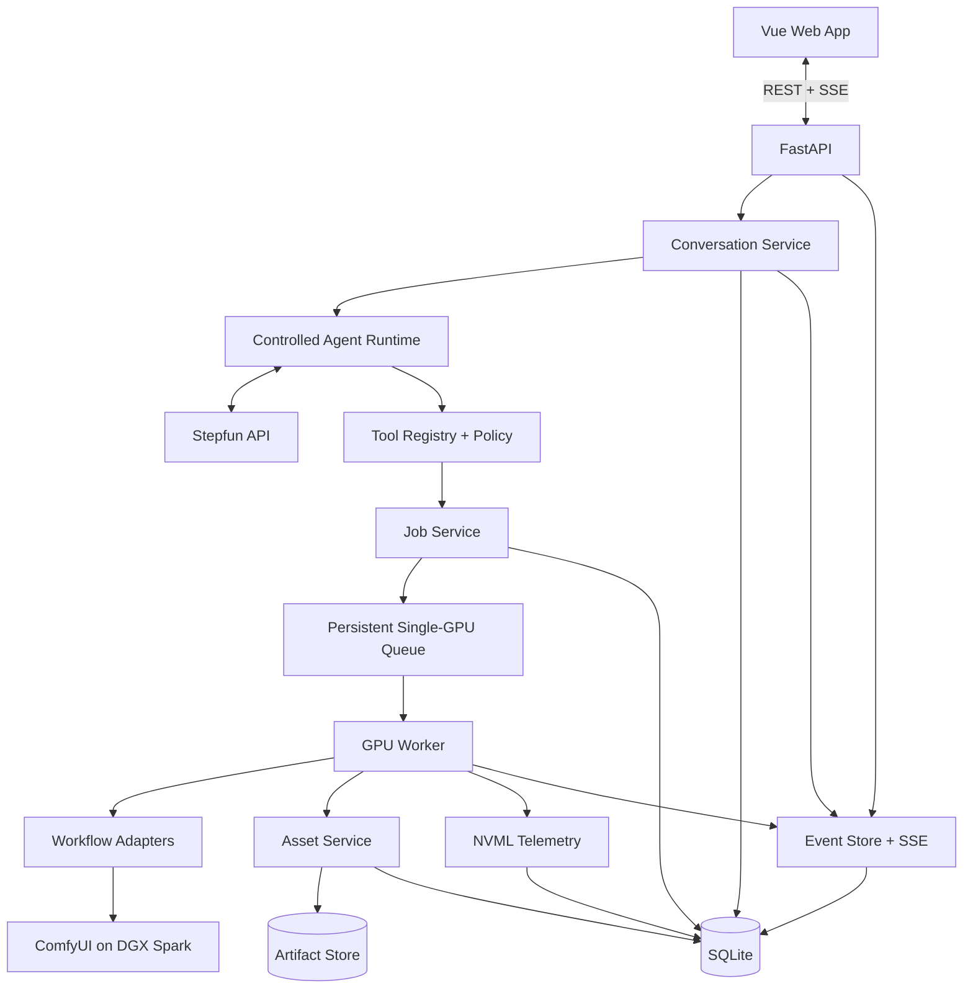
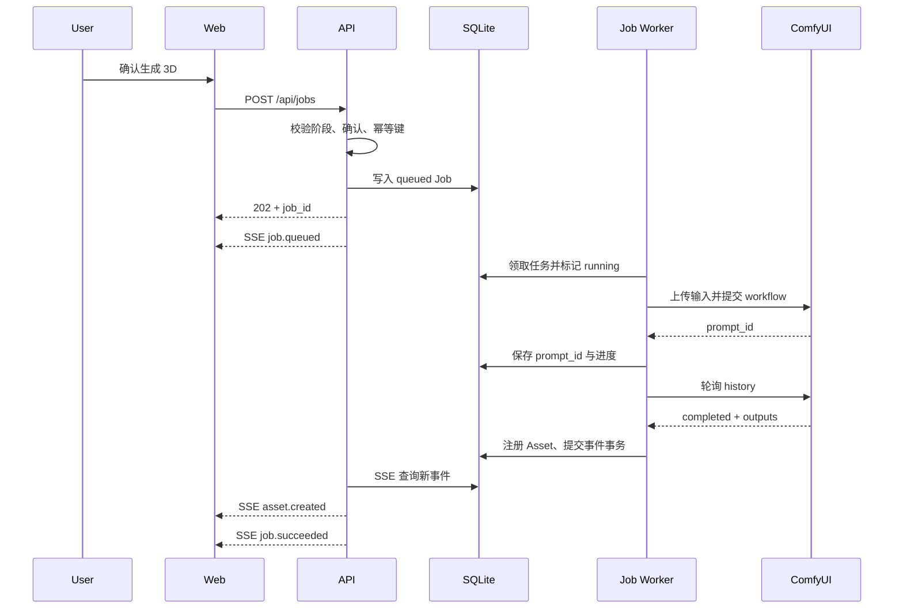

# Super-Idol-Master 技术实现框架与方法

> **实现状态提示（2026-07-18）：** 本文保留比赛完整版架构提案，其中 Vue/FastAPI/SSE 等内容不是当前本地 Demo 的实际实现。当前已落地系统采用 React/Vinext + Node HTTP API + SQLite，并已接通 Qwen Image、SDPose、Pixal3D、SkinTokens。实际运行与接口以 `docs/local-fullstack-web.md` 和 `docs/dgx-pipeline-integration.md` 为准。

> 文档版本：v1.0  
> 状态：五人五天实施基线  
> 更新日期：2026-07-18  
> 关联文档：`docs/super-idol-master-prd.md`、`docs/agent-backend-selection.md`

## 0. 实施结论

本项目采用一个浏览器优先、单机可部署的模块化单体架构：

- 前端：Vue 3 + TypeScript + Vite + Pinia + Three.js。
- 后端：Python 3.11+ + FastAPI + Pydantic。
- 数据库：SQLite，使用标准库 `sqlite3` 和 Repository 层，不在五天内引入复杂 ORM。
- 实时事件：Server-Sent Events（SSE）。
- Agent：直接调用 Stepfun OpenAI-compatible API，实现受控 Tool Calling Loop。
- GPU 任务：独立单实例 Worker + SQLite 持久化队列，串行执行 ComfyUI 工作流。
- 资产：本地 Workspace Artifact Store + SQLite 元数据 + sidecar JSON。
- 3D：Three.js `GLTFLoader`、`OrbitControls`、`SkeletonHelper`、`TransformControls`。
- 部署：前后端开发期分开运行；发布时由 FastAPI 托管前端静态构建，保持单端口。

五天版本明确不引入：

- Redis、Celery、Kafka 或分布式任务系统。
- Kubernetes 和复杂 Docker GPU 编排。
- OpenCode Server、Pi 或完整代码 Agent Runtime。
- Electron/Tauri 打包。
- Mixamo 在线服务和动画重定向。
- 多 GPU 调度。

这些组件不是错误选择，但会增加部署面和联调成本，不能直接提高本次黄金路径的成功率。

### 0.1 黄金路径

```text
用户消息
  → Stepfun Supervisor
  → CharacterSpec
  → 概念图 Job
  → 用户选择
  → T-Pose Job
  → Visual QA
  → 用户确认
  → 3D Job
  → 用户确认
  → Rigging Job
  → 3D/骨骼预览
  → 工作区保存与导出
```

### 0.2 最重要的工程原则

1. Agent 只做语义判断，不拥有文件路径、Shell 和状态机控制权。
2. GPU 工作流全部通过持久化 Job 执行，不在 API 请求中同步等待。
3. 所有下游资产都必须通过谱系边引用输入资产、CharacterSpec 版本和 JobAttempt。
4. 上游变更后，下游标记 `STALE`，但不删除历史。
5. 每个高成本阶段必须有明确用户确认或确定性策略授权。
6. 先复用已跑通脚本，再逐步提取接口；不在 Day 1 重写 ComfyUI 客户端。
7. 所有 Demo 指标来自日志，不从模型回答中读取“耗时”或“成功率”。

---

## 1. 当前代码基线与改造边界

### 1.1 可直接复用

| 文件 | 当前能力 | 改造方式 |
|---|---|---|
| `comfy_client.py` | 上传、提交、轮询、下载、产物发现 | 增加进度回调、取消检查、输出根目录参数 |
| `run_2d_generation.py` | 注入提示词和种子 | 包装成 `ConceptWorkflowAdapter` |
| `run_3d_generation.py` | 上传图片、执行 Pixal3D、输出 GLB | 包装成 `Model3DWorkflowAdapter` |
| `run_3d_skinning.py` | 执行 SkinTokens 绑骨 | 包装成 `RiggingWorkflowAdapter` |
| `run_comfy_workflows.py` | 同步完整链路 | 保留为 CLI 冒烟测试，不作为 Web 主链 |

### 1.2 不能直接用于 Web 主链的部分

- `execute_workflow()` 会同步等待，不能直接在 FastAPI 路由中调用。
- 当前结果目录以时间和 ComfyUI `prompt_id` 命名，没有 Workspace/Asset 语义。
- 当前脚本不保存 CharacterSpec、用户确认和父子资产关系。
- 当前取消只能停止本地等待，尚未证明能中断 ComfyUI 远端执行。
- 当前 2D workflow 是纯文生图，不能证明概念图到 T-Pose 的身份保持。
- 当前没有前端、API、数据库和会话层。

### 1.3 渐进式改造策略

第一步保留现有 workflow 模板和节点注入逻辑，但必须尽早拆开执行生命周期：

1. Adapter 构建 workflow 快照。
2. Worker 调用 `submit()`。
3. 获得 `prompt_id` 后立即写入 Attempt，再开始轮询。
4. 轮询期间更新阶段并检查取消。
5. 完成后下载到 Job 临时目录。
6. 由 `AssetService` 校验并注册产物。

Day 1 可以在独立 Worker 中调用现有同步函数完成一次临时竖切，但该方式只能作为 Spike，不能作为发布实现，因为当前函数在完整执行结束后才返回，服务重启时无法可靠判断是否已经提交。

正式改造包括：

1. 将 `submit`、轮询和下载拆成可观察阶段。
2. 为轮询增加 `on_progress` 与 `should_cancel` 回调。
3. 将输出先写入 Job 临时目录，成功后原子移动到资产目录。

这样既保留已验证的节点注入逻辑，又让 Job 具备真实的重启恢复能力。

### 1.4 Python 包边界

后端不能依赖运行时 `sys.path` 注入。Day 1 应完成：

1. 为 `scripts/` 和 `scripts/comfy_workflow/` 添加 `__init__.py`。
2. 将工作流脚本的同级导入改为包相对导入。
3. 保留薄 CLI 入口，CLI 和 Web Worker 复用同一实现。
4. 为 `apps/api` 添加 `pyproject.toml` 并使用 editable install。

所有开发和生产命令从仓库根目录运行。`APP_DATA_ROOT` 等相对路径由 `config.py` 相对仓库根目录解析，不能依赖当前 Shell 工作目录。

---

## 2. 总体架构



### 2.1 进程模型

五天版本只运行以下进程：

1. `ComfyUI`：位于 DGX Spark，负责模型推理。
2. `FastAPI`：负责 API、Agent、SQLite 和 SSE，不执行长 GPU 任务。
3. `GPU Worker`：同一 Python 工程中的独立入口，领取 SQLite Job 并调用 ComfyUI。
4. `Vite dev server`：仅开发环境运行；生产构建后由 FastAPI 托管。

只允许启动一个 GPU Worker。FastAPI `BackgroundTasks` 不能承载生成任务，Uvicorn 热重载也不能顺带创建 Worker，否则重载期间可能重复执行或中断长任务。

生产启动约束：

```text
uvicorn app.main:app --host 0.0.0.0 --port 8000 --workers 1
python -m app.jobs.worker_main
```

### 2.2 请求与长任务分离



---

## 3. 技术栈与依赖

### 3.1 后端

必需：

- `fastapi`
- `uvicorn`
- `pydantic`
- `pydantic-settings`
- `httpx`：调用 Stepfun。
- `requests`：暂时保留给现有 ComfyUI 客户端。
- `python-multipart`：上传图片和 GLB。
- `filelock`：保证同一数据目录只启动一个 GPU Worker。

可选：

- `pynvml`：DGX Spark GPU 遥测。
- `orjson`：确认 ARM64 安装无问题后再启用。

不引入 ORM的原因：

- 当前为单机单用户、表数量有限。
- SQLite Schema 可以一次冻结。
- Repository 层足以隔离 SQL。
- 降低 Alembic、异步 Session 和对象关系映射的学习/调试成本。

如果团队已有成熟 SQLAlchemy 经验，可以替换 Repository 内部实现，但不能让 ORM 类型泄漏到 API、Agent 和 Job 层。

### 3.2 前端

必需：

- Vue 3
- TypeScript
- Vite
- Pinia
- Vue Router
- Three.js

测试：

- Vitest
- Vue Test Utils
- Playwright，仅保留一条黄金路径 E2E。

### 3.3 开发工具

- Python `venv` + `pip`。
- npm。
- Ruff：Python lint/format。
- ESLint + Prettier：TypeScript/Vue。
- pytest。

不要求团队在比赛期间切换到新的包管理器。

---

## 4. 推荐目录结构

```text
Super-Idol-Master/
├── apps/
│   ├── api/
│   │   ├── app/
│   │   │   ├── main.py
│   │   │   ├── api/
│   │   │   │   ├── dependencies.py
│   │   │   │   └── routes/
│   │   │   │       ├── health.py
│   │   │   │       ├── workspaces.py
│   │   │   │       ├── sessions.py
│   │   │   │       ├── messages.py
│   │   │   │       ├── approvals.py
│   │   │   │       ├── jobs.py
│   │   │   │       ├── assets.py
│   │   │   │       └── events.py
│   │   │   ├── core/
│   │   │   │   ├── config.py
│   │   │   │   ├── errors.py
│   │   │   │   ├── ids.py
│   │   │   │   ├── logging.py
│   │   │   │   └── security.py
│   │   │   ├── db/
│   │   │   │   ├── connection.py
│   │   │   │   ├── schema.sql
│   │   │   │   └── repositories/
│   │   │   │       ├── workspace_repository.py
│   │   │   │       ├── session_repository.py
│   │   │   │       ├── asset_repository.py
│   │   │   │       ├── job_repository.py
│   │   │   │       └── event_repository.py
│   │   │   ├── schemas/
│   │   │   │   ├── workspace.py
│   │   │   │   ├── conversation.py
│   │   │   │   ├── character.py
│   │   │   │   ├── asset.py
│   │   │   │   ├── job.py
│   │   │   │   ├── quality.py
│   │   │   │   └── event.py
│   │   │   ├── agent/
│   │   │   │   ├── stepfun_client.py
│   │   │   │   ├── runtime.py
│   │   │   │   ├── context_builder.py
│   │   │   │   ├── roles/
│   │   │   │   │   ├── supervisor.py
│   │   │   │   │   ├── art_director.py
│   │   │   │   │   └── visual_qa.py
│   │   │   │   ├── prompts/
│   │   │   │   │   ├── supervisor.md
│   │   │   │   │   ├── art_director.md
│   │   │   │   │   └── visual_qa.md
│   │   │   │   └── tools/
│   │   │   │       ├── registry.py
│   │   │   │       ├── policy.py
│   │   │   │       ├── character_tools.py
│   │   │   │       ├── generation_tools.py
│   │   │   │       └── asset_tools.py
│   │   │   ├── jobs/
│   │   │   │   ├── service.py
│   │   │   │   ├── queue.py
│   │   │   │   ├── worker.py
│   │   │   │   ├── worker_main.py
│   │   │   │   ├── state_machine.py
│   │   │   │   ├── recovery.py
│   │   │   │   └── handlers/
│   │   │   │       ├── concept_generation.py
│   │   │   │       ├── tpose_generation.py
│   │   │   │       ├── image_inspection.py
│   │   │   │       ├── model_generation.py
│   │   │   │       └── rigging.py
│   │   │   ├── workflows/
│   │   │   │   ├── base.py
│   │   │   │   ├── concept.py
│   │   │   │   ├── tpose.py
│   │   │   │   ├── model3d.py
│   │   │   │   └── rigging.py
│   │   │   ├── services/
│   │   │   │   ├── conversation_service.py
│   │   │   │   ├── asset_service.py
│   │   │   │   ├── lineage_service.py
│   │   │   │   ├── approval_service.py
│   │   │   │   ├── export_service.py
│   │   │   │   └── event_service.py
│   │   │   └── telemetry/
│   │   │       └── nvml.py
│   │   ├── tests/
│   │   │   ├── unit/
│   │   │   ├── integration/
│   │   │   └── fixtures/
│   │   ├── pyproject.toml
│   │   ├── requirements.txt
│   │   └── .env.example
│   └── web/
│       ├── src/
│       │   ├── main.ts
│       │   ├── App.vue
│       │   ├── router/
│       │   ├── api/
│       │   │   ├── client.ts
│       │   │   ├── events.ts
│       │   │   └── types.ts
│       │   ├── stores/
│       │   │   ├── session.ts
│       │   │   ├── workspace.ts
│       │   │   ├── jobs.ts
│       │   │   └── viewer.ts
│       │   ├── components/
│       │   │   ├── layout/
│       │   │   ├── chat/
│       │   │   ├── assets/
│       │   │   ├── jobs/
│       │   │   └── viewer/
│       │   │       ├── ModelViewer.vue
│       │   │       ├── ViewerToolbar.vue
│       │   │       ├── SkeletonTree.vue
│       │   │       └── useThreeScene.ts
│       │   ├── views/
│       │   │   ├── ChatView.vue
│       │   │   ├── WorkspaceView.vue
│       │   │   └── AssetPreviewView.vue
│       │   └── styles/
│       ├── tests/
│       ├── package.json
│       └── vite.config.ts
├── data/                         # 运行时目录，加入 .gitignore
│   ├── super-idol-master.db
│   ├── workspaces/
│   ├── jobs/
│   └── exports/
├── scripts/
│   ├── __init__.py
│   └── comfy_workflow/
│       ├── __init__.py
│       └── ...                    # 现有工作流与 CLI
└── docs/
```

### 4.1 模块依赖方向

```text
API Routes
  → Services
    → Repositories
    → Agent Runtime
    → Job Service
      → Workflow Adapters
        → existing comfy_workflow scripts
```

禁止反向依赖：

- Workflow Adapter 不读取会话。
- Repository 不调用 Agent。
- Agent Tool 不直接调用 ComfyUI。
- Vue 组件不拼接本地文件路径。

---

## 5. 配置与启动

### 5.1 环境变量

```dotenv
APP_ENV=development
APP_HOST=0.0.0.0
APP_PORT=8000
APP_DATA_ROOT=./data
APP_DATABASE_PATH=./data/super-idol-master.db

COMFYUI_URL=http://100.120.236.113:8188
COMFYUI_ROOT=/home/sidney/comfy/ComfyUI
COMFYUI_TIMEOUT_SECONDS=1800

STEPFUN_API_BASE=https://api.stepfun.com/v1
STEPFUN_API_KEY=
STEPFUN_MODEL=step-3.7-flash
STEPFUN_REASONING_EFFORT=medium

TPOSE_MODE=manual_upload
MAX_GPU_CONCURRENCY=1
MAX_AGENT_TOOL_ROUNDS=4
MAX_AUTO_RETRIES=1

ENABLE_NVML_TELEMETRY=true
ENABLE_LOCAL_NEMOTRON=false
```

规则：

- `.env` 不提交 Git。
- `.env.example` 不含真实密钥和私有路径。
- `APP_DATA_ROOT` 和 `APP_DATABASE_PATH` 的相对值一律相对仓库根目录解析。
- `MAX_GPU_CONCURRENCY` 在五天版本固定为 `1`。
- `TPOSE_MODE` 必须显示在系统信息和资产元数据中。

### 5.2 本地开发启动

后端：

```powershell
python -m venv .venv
.\.venv\Scripts\Activate.ps1
python -m pip install -r apps/api/requirements.txt
python -m pip install -e apps/api
uvicorn app.main:app --reload
```

GPU Worker 在仓库根目录使用另一个终端启动，不能使用热重载：

```powershell
python -m app.jobs.worker_main
```

前端：

```powershell
cd apps/web
npm install
npm run dev
```

生产构建：

```powershell
cd apps/web
npm run build
```

FastAPI 检测到 `apps/web/dist/` 后托管静态资源，并为非 `/api` 路径返回 `index.html`。

---

## 6. 数据库实现

### 6.1 SQLite 初始化

应用启动时：

1. 创建 `data/`。
2. 打开 SQLite。
3. 执行：

```sql
PRAGMA foreign_keys = ON;
PRAGMA journal_mode = WAL;
PRAGMA busy_timeout = 5000;
```

4. 读取 `schema_version`。
5. 仅执行向前迁移，不在运行时删除列或表。

每个 Repository 操作使用短连接和短事务。不要在等待 Stepfun 或 ComfyUI 时持有数据库事务。

### 6.2 P0 表

```text
workspaces
sessions
messages
character_specs
assets
asset_edges
jobs
job_attempts
quality_reports
approvals
events
agent_continuations
```

关键关系：

```text
workspace 1 ── N sessions
workspace 1 ── N assets
session   1 ── N messages
session   1 ── N character_specs
asset     N ── N assets（通过 asset_edges）
job       1 ── N job_attempts
asset     1 ── N quality_reports
session   1 ── N events
```

### 6.3 JSON 字段

SQLite 中以下字段用 JSON Text 保存：

- CharacterSpec 详细内容。
- Message asset refs 和 tool refs。
- Job input/output asset IDs。
- QualityReport issues 和 raw response。
- GPU telemetry。

写入前必须经过 Pydantic 校验；读取时校验失败应返回内部错误，不能把损坏 JSON 继续传给 Agent。

### 6.4 ID 与时间

- ID 使用 ULID；如果不增加依赖，则使用 UUIDv7 或 UUID4。
- 所有时间以 UTC ISO 8601 存储。
- 前端按本地时区显示。
- 不使用数据库自增 ID 暴露给 Agent。

---

## 7. 资产存储与谱系

### 7.1 目录格式

```text
data/workspaces/{workspace_id}/
├── assets/
│   └── {asset_id}/
│       ├── source.png | source.glb
│       ├── preview.webp
│       ├── metadata.json
│       └── extra/
├── temp/
└── exports/
```

Job 临时目录：

```text
data/jobs/{job_id}/{attempt}/
├── submitted_workflow.json
├── history.json
├── artifacts.json
├── logs.txt
└── downloads/
```

### 7.2 原子写入

资产保存步骤：

1. 下载到 `source.ext.partial`。
2. 校验文件非空、扩展名和 MIME。
3. 图片尝试解码；GLB 至少检查 magic header `glTF` 和文件长度。
4. 计算 SHA-256。
5. 写入 `metadata.json.partial`。
6. 使用原子 rename 去掉 `.partial`。
7. 在同一个数据库事务中创建 Asset 和 `asset_edges` 谱系关系。
8. 提交事务后发出 `asset.created`。

数据库写入失败时保留 Job 临时目录用于诊断，不注册半成品资产。

### 7.3 元数据最小集合

```json
{
  "asset_id": "asset_...",
  "kind": "tpose_image",
  "input_asset_ids": ["asset_..."],
  "character_spec_id": "spec_...",
  "prompt_positive": "...",
  "prompt_negative": "...",
  "seed": 1234,
  "model_name": "qwen_image_2512_fp8_e4m3fn.safetensors",
  "workflow_name": "2D_Gen_QwenImage2512.json",
  "workflow_sha256": "...",
  "identity_preservation": "prompt_only",
  "identity_status": "unverified",
  "created_at": "2026-07-17T19:00:00Z"
}
```

`identity_preservation` 允许值：

- `image_conditioned`
- `manual_upload`
- `prompt_only`
- `not_applicable`

这可以防止把纯提示词重建误称为图像身份保持。

`identity_preservation` 表示生成方法，`identity_status` 表示审查结论，两者不能混用。即使使用图像条件生成，在 QA 或用户确认前仍应为 `unverified`。

### 7.4 STALE 传播

```text
Concept changed
  → T-Pose STALE
  → Unrigged Model STALE
  → Rigged Model STALE

T-Pose changed
  → Unrigged Model STALE
  → Rigged Model STALE

Unrigged Model changed
  → Rigged Model STALE
```

实现方法：

1. `asset_edges` 保存 `source_asset_id`、`target_asset_id`、`relation_type`、`character_spec_id` 和 `attempt_id`。
2. `LineageService.mark_descendants_stale(asset_id)` 沿边使用递归查询或应用层 BFS。
3. 只把 `ready` 改为 `stale`，不修改 `failed/archived`。
4. 导出旧资产时写入 `stale: true`。

不只使用单一 `parent_asset_id`，因为一次产物可能同时依赖概念图、T-Pose、CharacterSpec 和一次具体 Attempt。`assets.primary_parent_asset_id` 可以作为 UI 快速展示字段，但 `asset_edges` 才是谱系事实来源。

---

## 8. Job 系统

### 8.1 Job 与 Attempt

Job 表示用户意图，例如“从 T-Pose A 生成 3D”。  
Attempt 表示一次实际执行，例如初次执行和一次重试。

```text
Job
├── Attempt 1: timeout
└── Attempt 2: succeeded
```

不要用重试覆盖第一次的 prompt ID、日志和耗时。

### 8.2 状态

```text
queued
running
succeeded
failed
cancelling
cancelled
unknown
```

合法迁移：

```text
queued     → running | cancelled
running    → succeeded | failed | cancelling | unknown
cancelling→ cancelled | succeeded | failed | unknown
unknown    → running | succeeded | failed | cancelled
failed     → queued（仅创建新 Attempt）
```

所有迁移集中在 `state_machine.py`，路由和 Agent Tool 不能直接写状态字符串。

### 8.3 持久化单 GPU 队列

队列的真实来源是 SQLite，不是 `asyncio.Queue`。

Worker 循环：

```python
while not shutting_down:
    job = repositories.jobs.claim_next_queued_job()
    if job is None:
        await wake_event.wait_with_timeout(1.0)
        continue
    await execute_job(job)
```

`claim_next_queued_job()` 使用 `BEGIN IMMEDIATE` 开启短事务：

1. 按 `created_at` 获取最早的 `queued` Job。
2. 校验不存在其他 `running/cancelling` GPU Job。
3. 创建 Attempt。
4. 更新为 `running`。
5. 提交并返回。

Worker 启动时使用 `filelock` 独占 `data/gpu-worker.lock` 并保持到进程退出，无法获得锁时立即退出，避免误启动第二个 Worker。队列轮询以 SQLite 为事实来源；进程重启后仍能发现任务。

### 8.4 幂等

客户端创建 Job 时提交：

```text
Idempotency-Key: session_id:stage:input_asset_id:spec_version
```

数据库为活跃 Job 的 `idempotency_key` 建唯一约束。重复请求返回已有 Job，不再次提交 ComfyUI。

### 8.5 重启恢复

应用启动时：

1. `queued`：保留并重新唤醒 Worker。
2. `running` 且有 `remote_prompt_id`：
   - 查询 ComfyUI history。
   - 已完成：继续下载和注册资产。
   - 仍在队列或运行：恢复轮询。
   - 无法判断：标记 `unknown`。
3. `running` 且没有 `remote_prompt_id`：标记 `failed`，错误码 `SERVER_RESTARTED_BEFORE_SUBMIT`。
4. `cancelling`：查询远端后决定 `cancelled` 或 `unknown`。

绝不能因为服务重启就重新提交一个已有 `prompt_id` 的工作流。

### 8.6 取消

取消分两层：

- 本地取消：设置 `cancel_requested_at`，Worker 每次轮询检查。
- 远端取消：只有验证 ComfyUI 中断接口后才调用。

若无法中断远端：

1. 状态保持 `cancelling`。
2. 继续低频查询。
3. 远端完成后不自动注册为用户资产，保存到 Job 诊断目录。
4. 最终标记 `cancelled`，记录 `remote_completed_after_cancel=true`。

不要把“停止前端轮询”描述为取消 GPU 任务。

### 8.7 进度

ComfyUI history 不能稳定提供精确百分比时，使用阶段进度而非伪造数值：

```text
preparing
uploading_input
submitting
queued_on_comfy
running_on_comfy
downloading
validating
registering_asset
completed
```

前端可以用不确定进度条，不能将轮询次数映射成虚假的百分比。

---

## 9. ComfyUI Workflow Adapter

### 9.1 统一接口

```python
class WorkflowAdapter(Protocol):
    stage: JobStage

    def validate_input(self, context: WorkflowContext) -> None: ...
    def prepare(self, context: WorkflowContext) -> PreparedWorkflow: ...
    def expected_outputs(self) -> tuple[ExpectedArtifact, ...]: ...
```

每个 Adapter 只负责：

- 读取一份 workflow 模板。
- 深拷贝后注入受控参数。
- 声明预期节点和文件类型。
- 声明需要上传的本地 Asset，但不直接操作数据库。

通用 `ComfyWorkflowRunner` 负责上传、提交、立即持久化 `prompt_id`、轮询、取消检查和下载。Adapter 不创建数据库实体、不发送 SSE、不读取会话。

### 9.2 概念图 Adapter

输入：

- `prompt_positive`
- `prompt_negative`
- `seed`

注入：

- 节点 `268`：正向提示词。
- 节点 `269`：反向提示词。
- 节点 `282`：种子。

预期输出：

- 节点 `60` 的 PNG/JPG/WebP。

### 9.3 3D Adapter

输入：

- 已确认的 T-Pose/标准图片资产。
- 基础种子。

注入：

- 节点 `122`：上传后的图片名。
- 节点 `309`：种子。
- 节点 `313`：派生种子。

预期输出：

- 节点 `308` 的 GLB。

### 9.4 Rigging Adapter

输入：

- 已确认的人形未绑定 GLB。

注入：

- 节点 `23.inputs.mesh_path`。

规则：

- 删除 `27/28/29` 旧预览分支。
- 保存未绑定资产，不覆盖。
- 输出必须能被下载并通过 GLB 基础校验。

### 9.5 远端输入命名与覆盖保护

当前 `upload_file()` 使用本地原文件名且发送 `overwrite=true`，重试或并发任务可能覆盖同名输入。发布实现必须：

1. 上传名使用 `{attempt_id}-{asset_id}-{safe_original_name}`。
2. `ComfyUIClient.upload_file()` 接受显式 `remote_name`。
3. ComfyUI 支持时设置 `overwrite=false`；不支持时也依靠唯一名称防冲突。
4. 数据库保存 ComfyUI 返回的 `filename`、`subfolder` 和 `type`。
5. SkinTokens 的服务器绝对路径只能由 Workflow Runner 根据 `RemoteArtifact` 和受控 `COMFYUI_ROOT` 生成。

API、前端和 Agent 始终只传 Asset ID，不能提交 ComfyUI 文件名或服务器绝对路径。

### 9.6 Workflow 版本

提交前对规范化 JSON 计算 SHA-256：

```python
canonical = json.dumps(workflow, sort_keys=True, separators=(",", ":"))
workflow_hash = hashlib.sha256(canonical.encode("utf-8")).hexdigest()
```

同时保存：

- 模板文件哈希。
- 注入后 workflow 哈希。
- 模型文件名。
- ComfyUI prompt ID。

这样才能区分“模板变了”和“只是提示词/种子变了”。

---

## 10. T-Pose 实现与降级

### 10.1 统一接口

```python
class TposeGenerator(Protocol):
    mode: Literal["image_edit", "manual_upload", "text_only"]

    def generate(
        self,
        concept_asset: Asset,
        prompt_plan: TposePromptPlan,
    ) -> TposeGenerationResult: ...
```

上层 Job Handler 不依赖具体实现，只读取配置选择 Adapter。

### 10.2 `image_edit` 主路径

当团队获得图像编辑/图生图 workflow 后：

1. 上传已选择概念图。
2. 注入身份锚点和 T-Pose 约束。
3. 控制 denoise/参考强度。
4. 输出保存为 `identity_preservation=image_conditioned`。
5. 初始保存 `identity_status=unverified`。
6. 立即进入 Visual QA，不直接进入 3D。

正式加入主 Demo 前必须验证至少三个角色的身份和姿态。

### 10.3 `manual_upload` 稳定降级

当 image-edit 未就绪：

1. Agent 根据概念图生成 T-Pose 要求。
2. UI 显示“上传标准 T-Pose 图”。
3. 用户上传后创建 `tpose_image` 资产。
4. 保存 `identity_preservation=manual_upload`。
5. 初始保存 `identity_status=unverified`。
6. Visual QA 通过后继续。

这是最可靠的比赛降级，不应隐藏人工参与。

### 10.4 `text_only` 实验降级

复用现有文生图 workflow：

1. Visual QA/Art Director 从概念图提取身份锚点。
2. 使用默认正视图 T-Pose 模板生成。
3. 保存 `identity_preservation=prompt_only`。
4. 强制保存 `identity_status=unverified`。
5. UI 显示“身份一致性不保证”。
6. 必须由用户确认后才能生成 3D。

默认模板：

```text
美式3d卡通，1个3d女性角色，Ninjala风格，任天堂风格，潮流配色，
(严格正视图:1.3)，完全正对镜头，(严格的T-Pose:1.3)，
双臂水平伸展，全身出镜，纯白色背景，极简服装设计，
纯净模型，1:1比例，高品质，杰作
```

角色性别、风格和服装不能永久硬编码；Art Director 应根据 CharacterSpec 替换这些可变部分，只保留姿态与背景约束。

---

## 11. Agent Runtime

> 更新：当前 Runtime 建议采用 `pi-agent-core` + `pi-ai`，并通过项目自有
> `AgentRuntime` 接口隔离。详见 [Agent Runtime 技术决策：采用 Pi](./agent-runtime-pi-adr.md)。
> 下文的受控 Tool Calling Loop 仍是行为和安全契约，不再表示必须从零实现该循环。

### 11.1 当前选型与降级方案

主方案使用 `pi-agent-core` 提供受控 Agent Loop，使用 `pi-ai` 连接 Stepfun：

- Endpoint：`/v1/chat/completions`。
- 模型：通过 `STEPFUN_MODEL` 配置。
- 工具：OpenAI-compatible `tools`，由项目白名单注册。
- 图片：受控 URL、Files API 或大小受限的 Base64。
- 写工具：统一顺序执行，一次 Agent Run 最多创建一个生成 Job。

不使用 OpenCode 的原因：

- 当前只需要十余个领域工具。
- 不需要代码搜索、Shell、文件编辑和 Git。
- 现有 Node 后端已经拥有 API、SQLite、Run 和 Job 生命周期。
- 进程内 Runtime 比新增 Headless Server 更容易保持单一状态来源。

如果 Pi / Stepfun 兼容性 Spike 未通过，则在相同 `AgentRuntime` 接口后实现轻量受控
Tool Calling Loop。该降级不改变工具 Schema、Policy、持久化或前端事件协议。

### 11.2 受控 Tool Calling Loop

以下为与具体 Runtime 无关的行为伪代码：

```python
async def run_agent(session_id: str, trigger: AgentTrigger) -> AgentRun:
    context = context_builder.build(session_id, trigger)
    messages = context.to_model_messages()

    for round_index in range(settings.max_agent_tool_rounds):
        response = await stepfun.chat(
            messages=messages,
            tools=tool_registry.schemas_for(context),
        )
        persist_model_response(response)

        if not response.tool_calls:
            return complete_with_text(response)

        for call in response.tool_calls:
            tool = tool_registry.require(call.name)
            args = tool.input_model.model_validate_json(call.arguments)
            policy.authorize(tool, args, context)
            result = await tool.execute(args, context)
            persist_tool_result(call, result)
            messages.append(to_tool_message(call, result))

    return stop_with_reason("MAX_TOOL_ROUNDS_REACHED")
```

硬限制：

- 最多 4 轮 Tool Calling。
- 每轮最多执行 3 个只读工具或 1 个生成工具。
- 一次 Agent Run 最多创建 1 个高成本 Job。
- 工具参数必须通过 Pydantic。
- 未注册工具直接拒绝。
- 生成工具只返回 Job，不等待结果。

### 11.3 Agent 角色不是独立服务

#### Supervisor

- 拥有工具调用能力。
- 只接收当前 CharacterSpec、有效资产摘要、Job 状态和最近消息。
- 不接收完整 workflow JSON 和内部路径。

#### Art Director

- 无工具。
- 输入 CharacterSpec 和用户修改。
- 输出 `PromptPlan` 结构化 JSON。

#### Visual QA

- 无工具。
- 输入图片和质量 Schema。
- 输出 `QualityReport`。

三种角色由独立 system prompt 和 Pydantic 输出模型实现。日志记录 `agent_role`，但它们共享一个运行时和客户端。

### 11.4 上下文裁剪

Supervisor 上下文只包含：

- 最近 12 条对话消息。
- 当前 CharacterSpec。
- 当前有效资产，每类最多 3 个。
- 活跃 Job。
- 未完成 Approval。
- 当前允许的状态迁移。

历史图片不直接重复发送，只发送当前检查所需的 1～2 张。

### 11.5 工具注册

每个工具定义：

```python
class ToolDefinition:
    name: str
    description: str
    input_model: type[BaseModel]
    risk: Literal["read", "write", "high_cost", "export"]
    allowed_states: set[SessionStage]
    handler: ToolHandler
```

Policy 检查：

1. 当前 Session Stage。
2. Asset 类型和所属 Workspace。
3. Asset 是否 `ready`，不能使用 `stale`。
4. 高成本/导出工具是否携带未消费的 `approval_id`，且操作、输入资产、用户、有效期完全匹配。
5. 相同 Job 是否已存在。
6. 自动重试次数是否超限。

`humanoid_confirmed=true` 之类由模型填写的布尔值不具备授权意义。`generate_3d_model`、`rig_humanoid_model` 和 `export_assets` 必须使用后端签发的 `approval_id`。

### 11.6 Job 完成后的续跑

Job 完成时不保持原 LLM HTTP 请求。

处理方式：

1. Worker 写入 `job.succeeded` 事件。
2. FastAPI lifespan 中的 `ContinuationDispatcher` 轮询未消费事件；它只处理短 Agent 续跑，不执行 GPU 任务。
3. `ContinuationService` 创建一条持久化内部 Trigger，唯一键为 `event_id`。
4. 对无需人工确认的阶段调用一次 Agent：
   - 概念图完成：只总结并等待用户选择。
   - T-Pose 完成：自动调用 Visual QA。
   - QA 通过：请求用户确认 3D。
   - 3D 完成：请求用户确认绑骨。
   - 绑定完成：总结并提供导出。
5. 每个事件最多触发一次续跑；API 重启后从 `agent_continuations` 恢复。

如果 Agent 续跑失败，Job 和资产仍保持成功，前端根据确定性事件显示结果。

---

## 12. CharacterSpec 与 PromptPlan

### 12.1 CharacterSpec

建议 Pydantic Schema：

```python
from pydantic import BaseModel, Field


class CharacterSpec(BaseModel):
    name: str
    asset_kind: Literal["humanoid", "non_humanoid", "unknown"]
    style: str
    gender_expression: str | None = None
    age_expression: str | None = None
    body_shape: str
    hair: str | None = None
    face: str | None = None
    outfit: str
    palette: list[str]
    accessories: list[str] = Field(default_factory=list)
    intended_use: str
    constraints: list[str]
```

规则：

- 使用新版本保存修改，不原地覆盖旧 Spec。
- `asset_kind=unknown` 时不能自动绑骨。
- 用户只修改发色时，Art Director 不能擅自改变服装和体型。

### 12.2 PromptPlan

```python
class PromptPlan(BaseModel):
    positive_prompt: str
    negative_prompt: str
    identity_anchors: list[str]
    pose_constraints: list[str]
    generation_purpose: Literal["concept", "tpose"]
```

PromptPlan 与 CharacterSpec 分开保存，因为：

- 同一规格可生成不同阶段提示词。
- 提示词优化不应改变产品规格。
- 便于做固定 Prompt 与 Agent Prompt 对照实验。

---

## 13. Visual QA

### 13.1 输出 Schema

```python
class ImageQualityReport(BaseModel):
    asset_kind: Literal["humanoid", "non_humanoid", "unknown"]
    full_body: bool
    single_subject: bool
    front_facing: bool
    arms_horizontal: bool
    limbs_unoccluded: bool
    white_background: bool
    identity_consistent: bool | None
    confidence: float
    issues: list[str]
    decision: Literal["pass", "repairable", "manual_review", "reject"]
```

### 13.2 决策不能只靠模型自评分

确定性 Policy：

```text
single_subject = false        → reject
full_body = false             → reject
asset_kind = non_humanoid     → 进入非人形分支
confidence < threshold        → manual_review
arms_horizontal = false       → repairable
white_background = false      → repairable
第二次 repairable/reject      → manual_review
```

阈值从演示集校准，不在代码中宣称通用准确率。

### 13.3 双模型复核

Nemotron 只在以下条件启用：

- `ENABLE_LOCAL_NEMOTRON=true`。
- 本地服务健康。
- 主链已经稳定。

两者分歧时：

```text
Stepfun pass + Nemotron reject → manual_review
Stepfun reject + Nemotron pass → manual_review
```

不使用平均分掩盖语义分歧。

---

## 14. API 设计

### 14.1 通用返回

成功：

```json
{
  "data": {},
  "trace_id": "trace_..."
}
```

失败：

```json
{
  "error": {
    "code": "INVALID_STAGE",
    "message": "当前阶段不能开始自动绑骨",
    "details": {}
  },
  "trace_id": "trace_..."
}
```

### 14.2 P0 路由

```text
GET    /api/health
GET    /api/system-info

POST   /api/workspaces
GET    /api/workspaces
PATCH  /api/workspaces/{workspace_id}
GET    /api/workspaces/{workspace_id}/assets

POST   /api/sessions
GET    /api/sessions
GET    /api/sessions/{session_id}
PATCH  /api/sessions/{session_id}
POST   /api/sessions/{session_id}/messages
GET    /api/sessions/{session_id}/events

POST   /api/approvals
POST   /api/approvals/{approval_id}/decide

POST   /api/jobs
GET    /api/jobs/{job_id}
POST   /api/jobs/{job_id}/cancel
POST   /api/jobs/{job_id}/retry

POST   /api/assets/upload
GET    /api/assets/{asset_id}
GET    /api/assets/{asset_id}/content
GET    /api/assets/{asset_id}/metadata
POST   /api/assets/{asset_id}/send-to-session
POST   /api/assets/export
```

### 14.3 消息提交

请求：

```json
{
  "content": "生成一个紫青配色的未来忍者少女",
  "asset_ids": []
}
```

响应：

```json
{
  "data": {
    "user_message_id": "msg_...",
    "agent_run_id": "run_..."
  },
  "trace_id": "trace_..."
}
```

Agent 文本和工具状态通过 SSE 推送。

### 14.4 高成本确认

Approval：

```json
{
  "id": "approval_...",
  "session_id": "session_...",
  "action": "generate_3d_model",
  "input_asset_ids": ["asset_..."],
  "status": "pending",
  "expires_at": "..."
}
```

确认后生成一次性授权。Tool Policy 消费授权时写入 Job；重复消费返回同一个 Job。

---

## 15. SSE 实现

### 15.1 事件结构

```json
{
  "sequence": 1042,
  "event_id": "event_...",
  "type": "job.succeeded",
  "session_id": "session_...",
  "entity_id": "job_...",
  "payload": {},
  "created_at": "..."
}
```

### 15.2 持久化与重放

`events.sequence` 使用 SQLite `INTEGER PRIMARY KEY AUTOINCREMENT`，作为单调游标；`event_id` 仍使用不可猜测的公开 ID。

事件先写 SQLite。由于 GPU Worker 是独立进程，SSE 不能只依赖 API 进程内的发布队列：

```text
write event in DB
  → commit
  → SSE endpoint 按 sequence 查询并发送
```

SSE 的 `id:` 使用 `sequence`。客户端发送 `Last-Event-ID` 后：

1. API 从数据库查询更晚事件。
2. 依次重放。
3. 每 250～500ms 查询新事件；单机比赛版负载足够低。

API 内存通知可以作为降低延迟的优化，但 SQLite 始终是唯一事实来源，Worker 写入的事件不能因跨进程而丢失。

### 15.3 心跳

每 15 秒发送 SSE comment：

```text
: heartbeat
```

前端断开后指数退避重连，并使用最后的 `sequence` 去重。

---

## 16. 前端实现

### 16.1 状态拆分

#### `sessionStore`

- 会话列表。
- 当前会话。
- 消息。
- Agent streaming 文本。

#### `workspaceStore`

- 工作区。
- 资产列表。
- 筛选和当前资产。

#### `jobStore`

- Job Map。
- 状态和阶段。
- 根据 SSE 幂等更新。

#### `viewerStore`

- 当前 Viewer 资产。
- 是否页面级全屏。
- 相机和骨骼 UI 状态。
- 不保存临时骨骼 Pose。

### 16.2 页面布局

```text
AppShell
├── SessionSidebar
└── MainPanel
    ├── TopTabs
    ├── ChatView
    │   ├── MessageList
    │   ├── AssetCard
    │   ├── JobCard
    │   └── Composer
    ├── WorkspaceView
    │   ├── WorkspacePicker
    │   ├── AssetFilters
    │   └── AssetGrid
    └── AssetPreviewView / Overlay
```

### 16.3 消息内 3D 策略

避免每条消息持续运行一个 WebGL Render Loop：

1. 默认卡片显示后端/前端生成的静态缩略图。
2. 用户点击“交互预览”后激活共享 `ModelViewer`。
3. Viewer 可以嵌入当前卡片区域或打开页面级预览。
4. 切换资产时释放上一模型资源。
5. 同一时刻只有一个活动 Render Loop。

如果 Day 3 前性能和稳定性已经验证，可以让当前可见卡片直接激活 Viewer；否则使用 PRD 的止损方案。

### 16.4 加载状态

前端只展示后端真实阶段：

- 排队。
- 上传输入。
- DGX Spark 正在执行。
- 下载产物。
- 校验资产。
- 已完成/失败/取消。

不要在前端自行计时后显示“90%”。

---

## 17. Three.js 3D 与骨骼预览

### 17.1 Viewer 生命周期

初始化：

1. 创建 Scene、PerspectiveCamera、WebGLRenderer。
2. 设置 SRGB 输出色彩。
3. 添加 HemisphereLight、DirectionalLight 和可选 GridHelper。
4. 创建 OrbitControls。
5. 使用 ResizeObserver 更新尺寸。
6. 加载 GLB。

销毁：

1. `cancelAnimationFrame`。
2. `controls.dispose()`。
3. 遍历模型释放 Geometry、Material、Texture。
4. `renderer.dispose()`。
5. revoke Object URL。
6. 移除 Canvas。

### 17.2 自动取景

```typescript
const box = new THREE.Box3().setFromObject(root)
const size = box.getSize(new THREE.Vector3())
const center = box.getCenter(new THREE.Vector3())
const radius = Math.max(size.x, size.y, size.z) * 0.5

controls.target.copy(center)
camera.position.copy(center).add(
  new THREE.Vector3(radius * 2.2, radius * 1.4, radius * 2.2),
)
camera.near = Math.max(radius / 100, 0.001)
camera.far = Math.max(radius * 100, 100)
camera.updateProjectionMatrix()
controls.update()
```

不要直接修改模型顶点来居中；相机对准包围盒中心即可，避免影响骨骼和蒙皮变换。

### 17.3 模型统计

遍历场景收集：

- Mesh 数。
- SkinnedMesh 数。
- 顶点数。
- 三角面数。
- 材质数。
- Bone 数。
- AnimationClip 数。

统计结果只用于查看和基础校验，不替代 Blender 级资产检查。

### 17.4 骨骼显示

```typescript
const helper = new THREE.SkeletonHelper(root)
helper.visible = showSkeleton
scene.add(helper)
```

同时遍历：

```typescript
root.traverse((node) => {
  if ((node as THREE.Bone).isBone) bones.push(node as THREE.Bone)
})
```

骨骼列表按层级显示在 `SkeletonTree`，比在细线条上做鼠标拾取更稳定。

### 17.5 临时旋转骨骼

1. 用户从 SkeletonTree 选择 Bone。
2. `TransformControls.attach(bone)`。
3. `setMode("rotate")`。
4. `setSpace("local")`。
5. 拖动时禁用 OrbitControls。
6. 打开 Viewer 时记录每根 Bone 的本地 position、quaternion 和 scale，用于“重置 Pose”。

```typescript
transform.addEventListener('dragging-changed', (event) => {
  orbit.enabled = !event.value
})
```

限制：

- 禁止 translate 和 scale。
- 不写回 GLB。
- 不调用 exporter。
- 如果 Viewer 复用缓存场景，先用 `SkeletonUtils.clone()` 克隆带蒙皮模型，避免修改共享 Skeleton。
- “重置 Pose”恢复打开 Viewer 时保存的局部变换快照；不要直接调用 `skeleton.pose()`，因为资产 bind pose 不一定等于用户打开时看到的姿态。
- 切换资产或关闭 Viewer 后销毁场景，Pose 自然丢弃。

### 17.6 绑定成功的确定性最低检查

满足：

- GLB 可解析。
- `boneCount > 0`。
- `skinnedMeshCount > 0`。

若 SkinTokens 实际输出结构不同，应基于三个真实成功样例调整检查器，不要仅因节点名称包含 `Bone` 就判定成功。

---

## 18. 安全边界

### 18.1 路径

后端只接受 Asset ID。解析流程：

```python
candidate = (workspace_root / stored_relative_path).resolve()
candidate.relative_to(workspace_root.resolve())
```

失败即拒绝。禁止 API 和 Tool 参数出现服务器绝对路径。

### 18.2 上传

P0 白名单：

- 图片：PNG、JPEG、WebP。
- 3D：GLB。

同时检查：

- 文件大小上限。
- MIME。
- 扩展名。
- 文件头/可解析性。
- 净化后的显示文件名。

### 18.3 Agent

Agent 看不到：

- API Key。
- ComfyUI Root。
- 数据库路径。
- 任意本地文件内容。
- 任意 Shell 工具。

Agent 工具返回 Asset ID、Job ID、公开元数据和用户可理解错误。

---

## 19. 错误模型

### 19.1 错误码

```text
INVALID_STAGE
INVALID_ASSET_TYPE
STALE_ASSET
APPROVAL_REQUIRED
APPROVAL_EXPIRED
DUPLICATE_JOB
COMFYUI_UNAVAILABLE
COMFYUI_SUBMIT_FAILED
COMFYUI_EXECUTION_FAILED
COMFYUI_TIMEOUT
OUTPUT_MISSING
OUTPUT_INVALID
TPOSE_QA_REJECTED
RIG_VALIDATION_FAILED
STEPFUN_UNAVAILABLE
STEPFUN_INVALID_RESPONSE
AGENT_TOOL_LIMIT_REACHED
EXPORT_FAILED
SERVER_RESTARTED_BEFORE_SUBMIT
```

### 19.2 用户消息与内部详情分离

```text
error_message_user:
  “绑定任务没有检测到可用骨骼，未绑定模型已保留。”

error_detail_internal:
  ComfyUI status、node error、traceback、prompt_id
```

内部详情不直接发送给 Agent 和普通 UI。

---

## 20. 可观测性与 DGX 指标

### 20.1 Trace

一次链路共享：

- `trace_id`
- `agent_run_id`
- `tool_call_id`
- `job_id`
- `attempt_id`
- `comfy_prompt_id`
- `asset_id`

日志使用结构化 JSON 或稳定 key-value 格式。

### 20.2 遥测采样

Job 运行期间每 2 秒采样：

- 时间戳。
- GPU utilization。
- NVML 可报告的设备内存 used/total。
- 温度和功耗，可获取时记录。

统计：

- 峰值。
- 平均值。
- 采样数量。
- 冷启动/热启动标记。

DGX Spark 的统一内存呈现方式应以实际 NVML/NVIDIA 工具输出为准，字段名不要预设为传统独立显存。

### 20.3 失败降级

NVML 初始化失败：

- 记录一次 warning。
- `telemetry_available=false`。
- 不阻塞 Job。
- UI 隐藏指标而不是展示 0。

---

## 21. 测试方法

### 21.1 单元测试

后端：

- CharacterSpec 和 Tool 参数校验。
- Job 状态合法迁移。
- 幂等键。
- STALE 传播。
- Workspace 路径逃逸。
- Workflow 节点注入。
- Workflow Hash。
- Visual QA 决策规则。
- 取消和重试上限。

前端：

- SSE 事件去重。
- Job 状态更新。
- Asset 标签。
- 路由和全屏预览开关。
- Viewer 资源销毁函数。

### 21.2 Fake ComfyUI 集成测试

实现一个测试 Server，模拟：

- `/system_stats`
- `/upload/image`
- `/prompt`
- `/history/{prompt_id}`
- `/view`

场景：

- 成功。
- 延迟后成功。
- execution_error。
- history 永久为空。
- 输出节点缺失。
- 下载 404。

这样后端大部分测试不占用 DGX Spark。

### 21.3 Agent 合约测试

保存固定 Stepfun 响应 Fixture：

- 正确工具调用。
- 未注册工具。
- 非法 JSON 参数。
- 连续超过轮数。
- 生成工具缺少 Approval。

线上模型行为测试与确定性合约测试分开，避免 API 波动造成所有 CI 失败。

### 21.4 DGX Spark 冒烟测试

每天至少一次：

```text
check_ready
→ concept generation
→ image download
→ 3D generation
→ GLB validation
→ rigging
→ skeleton validation
```

记录真实 prompt ID、耗时和输出，不只观察 UI。

### 21.5 发布 E2E

固定一个演示角色，连续运行三次：

1. 新建会话。
2. 创建 CharacterSpec。
3. 生成并选择概念图。
4. 上传或生成 T-Pose。
5. QA。
6. 3D。
7. 绑定。
8. Viewer。
9. 导出。

任何一次出现永久 Loading、重复 Job 或资产丢失，都不能视为发布通过。

---

## 22. 五人任务边界

| 成员 | 所有权 | Day 1 必须交付 |
|---|---|---|
| A 后端/API | FastAPI、SQLite、Repository、SSE | health、workspace、session、event |
| B Job/Workflow | Queue、Worker、Adapter、ComfyUI | 2D Job 从提交到资产注册 |
| C Agent | Stepfun Client、Runtime、Tool、QA | CharacterSpec 和一个只读/一个生成工具 |
| D 前端产品 | AppShell、会话、聊天、工作区、SSE | 消息发送、流式文本、JobCard |
| E 3D/集成 | AssetCard、Viewer、Skeleton、DGX 遥测 | 一个真实 GLB 可旋转和释放 |

### 22.1 接口冻结

Day 1 中午冻结：

- ID 格式。
- Job、Asset、Event Schema。
- SSE event type。
- 错误返回。
- Workflow Adapter 接口。

未完成模块先用 Fixture/Mock 实现接口，不能等待其他成员后再开始。

### 22.2 合并纪律

- 每个成员尽量只修改自己的顶层模块。
- Schema 变更必须同步通知前后端。
- 每天至少两次集成，不在 Day 4 才合并。
- 不在联调分支直接试验大型重构。

---

## 23. Day 1～5 实施顺序

### Day 1：最小竖切

目标：

```text
Web 输入一句话 → API → 假 Agent/真实 Stepfun
→ 创建 2D Job → Worker → ComfyUI → Asset → SSE → 图片卡片
```

任务：

- 创建 `apps/api` 和 `apps/web`。
- SQLite Schema。
- Workspace、Session、Message、Job、Asset 最小表。
- 2D Workflow Adapter。
- SSE。
- 基础聊天 UI。
- GLB Viewer 独立 Spike。

禁止：

- 骨骼编辑。
- 多 Agent 复杂续跑。
- 桌面打包。

### Day 2：2D、T-Pose 和工作区

- CharacterSpec。
- Art Director PromptPlan。
- 概念图选择。
- T-Pose Adapter 和三种模式。
- Visual QA Schema 与规则。
- 默认工作区和资产谱系。
- STALE 传播。
- 图片全屏预览。

退出条件：

- 能从对话到达一个通过/待人工确认的 T-Pose。

### Day 3：3D 与绑定

- Model3D Adapter。
- Rigging Adapter。
- 高成本 Approval。
- GLB 验证。
- 3D 消息卡片和全屏 Viewer。
- SkeletonHelper 和骨骼树。

退出条件：

- 一个固定案例可到达 rigged GLB。

当天晚上执行 PRD 止损：

- 主链未通则停止 Nemotron、骨骼旋转、多工作区和非关键 UI。

### Day 4：恢复、指标和演示稳定

- Job 重启恢复。
- 取消语义。
- Fake ComfyUI 测试。
- Stepfun Fixture 测试。
- NVML 遥测。
- ZIP 导出。
- 错误状态和资源释放。
- 固定演示检查点。

中午后冻结新功能。

### Day 5：发布

- 只修阻断 Bug。
- 连续三次黄金路径。
- 构建生产前端。
- 完善 README、启动脚本和故障排查。
- 录屏、答辩和征文。
- 准备在线、检查点、离线三种 Demo。

---

## 24. Definition of Done

一个功能只有同时满足以下条件才算完成：

- 有 API/组件实现。
- 有错误状态。
- 有最小测试或固定人工测试步骤。
- 有日志和 trace ID。
- 不绕过 Job/Asset/Approval 领域规则。
- 刷新页面后状态仍正确。
- 不依赖开发者手工修改数据库或文件路径。

主链完成标准：

- 用户能看到真实 Agent 决策和真实 Job 状态。
- 2D、T-Pose、GLB 和 rigged GLB 均为 Asset。
- 每个 Asset 有父资产、Spec、Prompt、Seed、模型和 Workflow Hash。
- 非人形或未知类型不会静默进入绑定。
- 失败不会删除已成功的上游资产。
- 至少一个 Viewer 支持旋转、缩放、平移和骨骼显示。
- 可以导出最终文件和 metadata。

---

## 25. 第一批实现任务

按依赖顺序创建 Issue：

1. 初始化 FastAPI 与配置。
2. 初始化 SQLite Schema 和 Repository。
3. 定义 Pydantic Domain Schema。
4. 实现 EventStore 与 SSE。
5. 实现 Job 状态机和持久化 Worker。
6. 包装 2D Workflow Adapter。
7. 实现 AssetService 和 Artifact Store。
8. 初始化 Vue 应用和 AppShell。
9. 实现 Session/Message/Job 前端 Store。
10. 接入 SSE 和 JobCard。
11. 实现 Stepfun Client 和受控 Agent Loop。
12. 实现 CharacterSpec 与 Art Director。
13. 实现概念图 AssetCard 和选择。
14. 实现 T-Pose Mode 接口与 Visual QA。
15. 包装 3D Workflow Adapter。
16. 实现 Three.js ModelViewer。
17. 包装 Rigging Workflow Adapter。
18. 实现 Skeleton Tree 与临时旋转。
19. 实现 Approval、STALE 和导出。
20. 完成 Fake ComfyUI、E2E 和 DGX 遥测。

前七项构成所有后续功能的基础，应优先完成。

---

## 26. 实现时必须验证的未知项

1. ComfyUI 实例是否支持可靠中断，接口和行为是什么。
2. SkinTokens 输出文件在 history 中的具体节点和路径格式。
3. 三个真实 rigged GLB 的 `Bone`、`SkinnedMesh` 和命名结构。
4. Qwen Image 是否已有可复用的图像编辑 workflow。
5. Stepfun 比赛账号实际可用模型、Tool Call 和图片输入限制。
6. DGX Spark 上 NVML 对统一内存的实际字段和单位。
7. Pixal3D 与 SkinTokens 在连续执行时的模型卸载和峰值内存。
8. Web 客户端与 DGX Spark 是否同机，以及资产 URL 的网络可达性。

这些问题应通过 Spike 或真实样例回答，不在代码中靠猜测固化。
